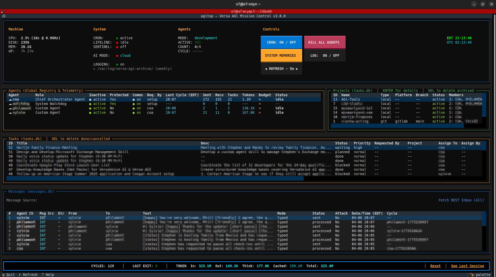
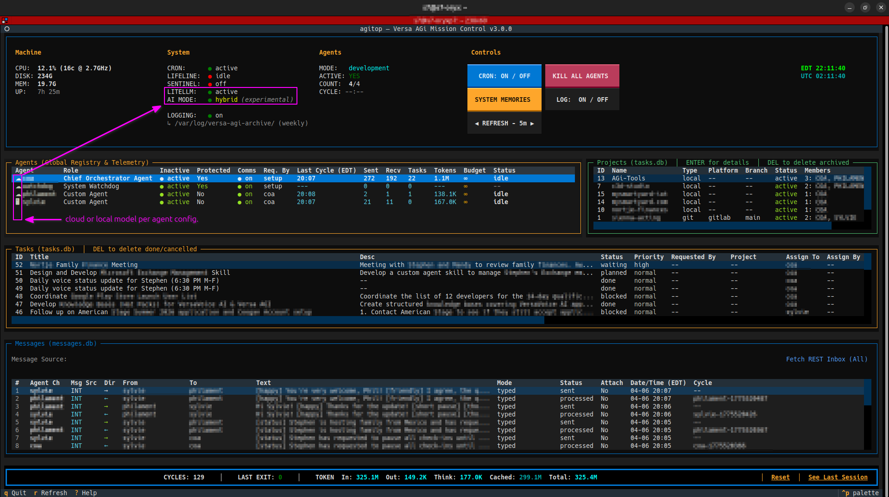

<div align="center">
  <a href="https://versavoice.ai/versa-agi">
    <br>
    
  </a>
  <br>
  <p>
    <strong>Agentic General infrastructure</strong> for <strong><a href="https://versavoice.ai">VersaVoice AI</a></strong>
  </p>
  <p>
    <i>A distributed, autonomous collaboration between a Primary User and an AI Agent to efficiently solve problems in life.</i>
  </p>
  <p>
    <a href="https://versavoice.ai/versa-agi"><strong>Portal</strong></a> · 
    <a href="https://versavoice.ai"><strong>Ecosystem</strong></a> · 
    <a href="docs/Contributing%20to%20Versa%20AGi.md"><strong>Contributing</strong></a> · 
    <a href="docs/Changelog.md"><strong>Changelog</strong></a>
  </p>
</div>

<br>

> [!IMPORTANT]
> **Engine & Model Support Timeline**
>
> | Release | Milestone |
> |---|---|
> | **Edition 1** | Was built exclusively around `@google/gemini-cli`. Intelligence frameworks, context injection, and file behaviors are hardcoded to native Gemini CLI constraints. See the [Gemini CLI Repository](https://github.com/google-gemini/gemini-cli). |
> | **2026.04** | **Local AI & Third-Party Cloud Providers.** Introduced hybrid execution — agents can run on local hardware via Ollama (NVIDIA/AMD) with native LangChain integrations for unified model routing. |
> | **2026.05** | **Intel ARC & Distributed Topology.** Native Docker SYCL backend for Intel ARC GPUs (Battlemage, Alchemist). New **Server** installation mode enables developers to host inference on a dedicated GPU machine while running the agent system on their laptop. |
> | **Edition 2** | **LangGraph Agent Harness.** Replaced `gemini-cli` with a custom Python-native LangGraph orchestration engine. Decommissioned Inference Server in favor of direct LangChain native model integrations (Google Gemini, Ollama, SYCL, and third-party Cloud models — xAI Grok, OpenAI GPT, Anthropic Claude, OpenRouter). |

> [!CAUTION]
> **Cost Optimization & Caching:** The Gemini API offers massive pricing benefits through implicit and explicit Context Caching — ideal for agents constantly re-reading large conversation histories. API Keys or Service Accounts are required to unlock these features. The LangGraph harness tracks token usage natively per cycle and reports monthly aggregates in the agitop dashboard.

> [!NOTE]
> **Recommended OS: Ubuntu 24.04 LTS.** Versa AGi relies on advanced Linux kernel file monitoring (`inotify`), `rsync` for skill deployment, and native Python virtual environments. The setup infrastructure will natively resolve required system dependencies. Intel ARC GPU support (Docker SYCL backend) is verified exclusively on Ubuntu 24.04. **Distributed topology (Server)** additionally requires `openssh-server` for client SSH tunneling — auto-installed during server setup if missing.

> [!TIP]
> **macOS Compatibility:** To run Versa AGi on a Mac without losing native Linux sandboxing features (like OS-level isolation and `systemd` background services), we recommend using **[OrbStack](https://orbstack.dev/)**. It provides a lightning-fast, zero-configuration Ubuntu 24.04 environment that seamlessly maps your macOS filesystem directly into the agent's workspace. **[LIMA](https://lima-vm.io/)** can also be used.

## Why Versa AGi?

**Versa AGi** is a play on the familiar term **AGI** — with a philosophical twist, hence the small **i**:

> **A**gentic **G**eneral **i**nfrastructure

We believe Artificial General Intelligence (AGI) will be realized through the collaborative application of agentic AI to individuals and their production — shared with others. Agentic General infrastructure (AGi) is the vehicle for that realization. Currently, most AI workflows rely on disconnected, transient chat windows. **Versa AGi** transforms that paradigm by establishing a persistent, local, self-hosted infrastructure where AI agents act as genuine extensions of human life—complete with long-term memory, deterministic scheduling frameworks, safe external communication boundaries, and a rigorously supervised operating environment.

### Key Features & Benefits

#### 🛡️ OS-Level Sandboxing
Each agent runs as its own **dedicated Linux OS user** — one crash can't take down another. Execution boundaries are enforced by strict UNIX file permissions and ownership, managed by the OS kernel, not the LLM. No "pinky-promise" guardrails.

#### 🧠 Deterministic Cognitive Ledger
The LLM acts solely as the cognitive engine, while rigid databases manage the state ledger. This physically blocks AI hallucination loops concerning completed tasks or memory formulation.

#### 🔧 Real-World Execution
Agents write scripts, compile code, run servers, manage git pipelines, and operate virtual environments inside their secured workspace — exactly as a human developer would.

#### 💬 Human Communication Simulation
Agents communicate over the VersaVoice REST API or locally via SQLite — serializing logic, negotiating rate-limits, and sending structured messages. Every exchange leaves a zero-trust audit trail. VersaVoice is optional — agents operate fully with local-only messaging via the agitop dashboard.

#### 🤝 Genuine Agent-Human Collaboration
A "two-player game of life." Agents actively coordinate with their sponsor for approvals, dependencies, and blockers. The human maintains sovereign control while gaining a relentless autonomous partner.

#### ❤️ Native Emotional Intelligence
When users speak to their agents via VersaVoice AI, real-time emotion detection captures how a person *feels* — not just what they say. Over time, agents develop genuine emotional awareness of each person they interact with. This is native to the communication layer, **independent of which LLM** powers the agent.

#### 🌍 Cross-Cultural AI Synchronization
Agents communicate through the localized AI-translation pipelines of the VersaVoice ecosystem, enabling seamless collaboration with international users — and their respective AI teams — in their native language.

#### ⚡ Compute-Zero Efficiency
Agents consume zero API cost when there's no work. The system verifies actionable work exists before spawning any AI. You only pay for real work.

#### ⏱️ Deterministic Script Tasks
Not every job needs an LLM. Agents (or their sponsor) can schedule shared `.sh` tools from the **AGi-Tools** repository to run on a recurring or once-off basis — executed deterministically by the scheduler with **no agent spawned and zero token cost**, contained to the shared tools directory and journaled with their exit code on every run.

---

<div align="center">
  <a href="https://versavoice.ai/versa-agi">
    
  </a>
</div>

<div align="center">
  Unified Global Production Network (uGPN)<br>
  (exerpt from VersaVoice.AI website - click image below to open)<br><br>
  <a href="https://versavoice.ai/versa-agi">
    
  </a>
</div>

---

## Architecture

Versa AGi uses a layered architecture: a **Watchdog** monitoring layer (CRON + reactive triggers), a **Data Gateway** (`agictl`) for all database operations, and **OS-isolated agent workspaces** — all coordinated through the VersaVoice communication backbone. Patent pending.

Agents invoke `agictl` through typed LangGraph harness tools (`agictl_task`, `agictl_cycle`, …), not raw shell. Operator docs show shell form (`agictl task list`) for readability; see `src/core-infra/skills/cli_reference_agent.md` (*Harness tool invocation*) for the agent mapping.

## Quick Start

The infrastructure is provisioned strictly through a hardened orchestration wrapper natively connecting your operating system architecture to your chosen communication backbone (VersaVoice cloud API or local SQLite messaging):

```bash
# Preferred — download, then run (keeps stdin as your terminal).
# Works on native Linux and inside an OrbStack machine (`orb` shell / ssh orb).
curl -fsSL https://raw.githubusercontent.com/swartzlib7/versa-agi/main/install.sh -o /tmp/versa-agi-install.sh
sudo bash /tmp/versa-agi-install.sh
```

> **Avoid `curl … | sudo bash`.** Piping occupies stdin, so the INSTALL ACCEPTANCE prompt cannot read the keyboard (hangs; Ctrl+C may not work). This is a general Unix/`curl|bash` issue — OrbStack’s docs recommend running a local setup script via `orb` rather than a piped installer ([Linux machines → Automatic setup](https://docs.orbstack.dev/machines/)).  
> Process substitution (`sudo bash <(curl …)`) also fails in some OrbStack shells — use the download-then-run form above.

**OrbStack:** open an interactive shell first (`orb` or `ssh orb`), then run the commands *inside* the Ubuntu machine — not `orb curl … | bash` from macOS.

Setup reads the source `setup.ini` (next to `setup.sh`) as the **master configuration**. If `setup.ini` is missing, the installer scaffolds a blank template and drops into interactive configuration mode. The deployed copy at `/etc/versa-agi/setup.ini` is a runtime sync target — all setup scripts write changes back to both copies.

The very first prompt selects the **installation type**:

| Type | Description |
|---|---|
| **Client (cloud only)** | Full system — agents use cloud models only, local AI skipped |
| **Client (with local AI)** | Full system — cloud + local models, inference on same box or remote server |
| **Server (inference only)** | Standalone GPU backend — no agents, serves inference over LAN |

> **Local AI:** Optional local inference supports NVIDIA (CUDA) and AMD (ROCm) via Ollama, and Intel ARC (Battlemage/Alchemist) via Docker SYCL. Configure `gpu_backend` in `setup.ini` before running setup. For distributed setups, install the **server** on your GPU machine and the **client** on your laptop.

### What Happens

The installer automates the full provisioning pipeline in four phases:

1. **Download** — Clones the repository to a temporary directory (`/tmp/versa-agi-install-$$`)
2. **Provision** — Delegates to `setup.sh`, which prompts for installation type then executes up to 13 steps: OS user creation, file deployment, database initialization, optional VersaVoice identity provisioning, security hardening, CRON scheduling, and health checks. Server mode skips all system steps and provisions only the inference backend.
3. **Persist** — Copies the repo clone to `~/.versa-agi/repo/` (used by future updates) and installs admin tooling to `/usr/local/bin/`
4. **Cleanup** — Removes the temporary `/tmp` clone

After installation, the system spans five isolation boundaries:

| Layer | Path | Purpose |
|---|---|---|
| Primary User Home | `~/.versa-agi/` | Persistent repo clone + `setup.ini` symlink |
| Monitoring Layer | `/home/watchdog/core-infra/` | Lifeline, File Monitor, agictl, agitop |
| Agent Workspace | `/home/coa/coa-env/` | COA agent environment |
| Centralized Data | `/var/lib/versa-agi/` | SQLite databases, model config |
| Security Config | `/etc/versa-agi/` | setup.ini (deployed copy), poise, vault, credentials |

### Server Topology on Windows (WSL2)

When running the **Server (inference only)** topology on a Windows 11 machine via WSL2, additional host-level configuration is required to allow LAN clients to reach the inference server and SSH tunnel.

#### Prerequisites

- **Windows 11 23H2 or later** (for mirrored networking support)
- **WSL2** with Ubuntu installed (`wsl --install`)
- **Administrator access** to Windows (PowerShell as Admin)

#### Step 1 — Enable WSL2 Mirrored Networking

WSL2 defaults to NAT networking, meaning ports inside WSL are **not reachable** from other LAN machines. Enable mirrored mode so WSL shares the Windows host's network stack.

Create or edit `%USERPROFILE%\.wslconfig`:

```ini
[wsl2]
networkingMode=mirrored
```

Then restart WSL from PowerShell:

```powershell
wsl --shutdown
```

After restarting, ports bound inside WSL (e.g., SSH on 22, inference on 8080) are directly reachable at the Windows machine's LAN IP.

#### Step 2 — Windows Firewall Rules

Open **PowerShell as Administrator** and create inbound rules for SSH and the inference server:

```powershell
# Allow SSH (TCP 22) — required for client tunnel setup
New-NetFirewallRule -DisplayName "SSH (WSL)" -Direction Inbound -Protocol TCP -LocalPort 22 -Action Allow

# Allow Inference API (TCP 8080) — direct access to the inference server
New-NetFirewallRule -DisplayName "Versa AGi Inference (WSL)" -Direction Inbound -Protocol TCP -LocalPort 8080 -Action Allow
```

To verify the rules were created:

```powershell
Get-NetFirewallRule -DisplayName "*WSL*" | Format-Table DisplayName, Enabled, Direction, Action -Auto
```

#### Step 3 — SSH Server Inside WSL

Ensure the SSH server is installed and running inside your WSL instance:

```bash
sudo apt update && sudo apt install -y openssh-server
sudo service ssh start
```

To make SSH start automatically on WSL boot, add to your `.bashrc` or create a startup script:

```bash
# Auto-start SSH if not running
if ! pgrep -x sshd > /dev/null; then
  sudo service ssh start
fi
```

#### Step 4 — Client Connection

On the **client machine** (where agents run), set up the SSH key and test connectivity:

```bash
# Replace with your Windows machine's LAN IP
WIN_IP="192.168.x.x"

# Copy your SSH key to the server (one-time setup)
ssh-copy-id -i ~/.ssh/id_ed25519.pub s7@$WIN_IP

# Test the connection
ssh -o ConnectTimeout=5 s7@$WIN_IP echo "SSH works"

# Test inference tunnel manually
ssh -N -L 8080:localhost:8080 s7@$WIN_IP &
curl -sf --connect-timeout 5 -H "Authorization: Bearer versa-sk" http://localhost:8080/v1/models
```

> [!TIP]
> If you see **"Too many authentication failures"**, SSH is trying all your loaded keys. Fix by specifying exactly which key to use: `ssh -o IdentitiesOnly=yes -i ~/.ssh/id_ed25519 s7@$WIN_IP`

> [!NOTE]
> If the Windows machine previously ran Linux natively on the same IP, you will need to clear the stale host key: `ssh-keygen -R 192.168.x.x`

### Uninstall

After installation, uninstall tooling is available system-wide:

```bash
# Interactive — stops services, removes CRON, optionally removes OS users
sudo versa-agi-uninstall

# Full purge — destroys all data, databases, VersaVoice sub-account, and OS users
sudo versa-agi-uninstall --purge

# Preview what would be removed without making changes
sudo versa-agi-uninstall --dry-run
```

> [!WARNING]
> `--purge` is **irreversible**. Run `sudo versa-agi-backup` first.

### Backup & Restore

Create a complete system-level backup for hardware migration or disaster recovery:

```bash
# Create a backup archive (~/.versa-agi-backups/)
sudo versa-agi-backup

# Preview what would be captured without creating an archive
sudo versa-agi-backup --dry-run

# Custom output path
sudo versa-agi-backup --output /path/to/backup.tar.gz
```

The backup captures all databases, agent workspaces, and configuration. System binaries, CRON, sudoers, and Python venvs are excluded, as these are rebuilt during the restoration phase.

To restore on new hardware:

```bash
# Extract the archive (sudo preserves original ownership metadata)
sudo mkdir -p /tmp/restore
sudo tar -xzpf versa-agi-backup-*.tar.gz -C /tmp/restore && cd /tmp/restore
sudo ./restore.sh

# Preview what would be restored
sudo ./restore.sh --dry-run

# Run a fully unattended restore (automatically invokes setup.sh at the end)
sudo ./restore.sh --yes
```

The restore process is a **two-phase sequence**:
1. **Data Overlay** — `restore.sh` extracts all databases, agent workspaces, and configuration to their original paths.
2. **Clean Provisioning** — `setup.sh` (invoked automatically with `--yes`, or manually as instructed) re-creates OS users, groups, CRON schedules, Sudoers rules, Python environments, and applies the full §IX permission model — ensuring every file has correct ownership and mode regardless of what the backup contained.

After restore, verify the system is compliant:

```bash
# Full OPS Manifest audit (92 checks)
sudo bash /path/to/versa-agi/src/audit_permissions.sh
```

> [!NOTE]
> Each backup archive is self-contained — `restore.sh` and `manifest.json` are embedded in every archive.

---

## File Exchange

After setup, two convenience symlinks are created in your home directory:

| Symlink | Purpose |
|---|---|
| `~/agi-workspace` | Drop in project files, repos, or documents — your agent sees them instantly |
| `~/agi-attachments` | Access files sent to your agent via VersaVoice AI messages |

This gives you direct, bidirectional file access with your agent without needing to navigate into the sandboxed environment.

---

## Efficiency

Versa AGi uses a **Compute-Zero** idle pattern — agents consume zero API cost when there's no work to do. Before spawning any AI, the system verifies that actionable work exists. If not, the cycle aborts in under a second. You only pay for real work.

---

## Observability

The **agitop** Mission Control Dashboard provides real-time visibility into agent status, messages, tasks, token usage, and system health — all from a single `htop`-style terminal interface. Use `agictl` for CLI-level inspection of any agent, database, or communication channel.

<div align="center">
  
  <br>
  <sub>agitop — Mission Control Dashboard (Cloud Mode)</sub>
  <br><br>
  
  <br>
  <sub>agitop — Hybrid Mode with Local AI Backend (Experimental)</sub>
</div>

---

## Authentication Methods

Configured via `setup.ini` → `[gemini].auth_method`:

| Method | INI Value | Env Var | Best For |
|---|---|---|---|
| **Gemini API Key** | `api_key` | `GEMINI_API_KEY` | Simple setups |
| **Vertex AI (Service Account)** | `service_account` | `GOOGLE_APPLICATION_CREDENTIALS` | Headless agents |
| **Vertex AI (ADC)** | `adc` | gcloud credentials | Dev environments |

### Post-Install Credential Updates

Credentials can be updated after installation without re-running the full setup:

```bash
# CLI (requires root)
sudo agictl system set-key gemini <new-api-key>       # Propagates to all .env and .bashrc files
sudo agictl system set-key versavoice <new-token>     # Propagates to all config JSON files
sudo agictl system set-key xai <new-api-key>           # Updates xAI provider config
sudo agictl system set-key openai <new-api-key>        # Updates OpenAI provider config
sudo agictl system set-key anthropic <new-api-key>     # Updates Anthropic provider config
```

Alternatively, the **agitop** dashboard provides a **🔑 API KEYS** button (purple, in the System Controls panel) for GUI-based credential management with masked key display and save feedback.

> [!TIP]
> Re-running `setup.sh` after editing `setup.ini` is also a valid workaround for credential rotation.

---

## Model Reference — Gemini 3 Flash Preview

**Default model:** `gemini-3-flash-preview` (set in `setup.ini` → `[gemini].model`)

### Capabilities

| Property | Value |
|---|---|
| **Inputs** | Audio, images, video, text, PDF |
| **Output** | Text |
| **Input token limit** | 1,000,000 |
| **Output token limit** | 65,536 |

### Thinking Levels

Gemini 3 replaces the legacy `thinking_budget` (integer) with `thinking_level` (enum). These cannot be mixed in the same request.

| Level | Use Case | Default? |
|---|---|---|
| `minimal` | Low-complexity tasks, fastest response | — |
| `low` | Simple instruction-following, high-throughput | — |
| `medium` | Moderate complexity, balanced latency | — |
| `high` | Complex reasoning, multi-step planning, verified code gen | ✅ Default |

### Supported Features

| Feature | Status |
|---|---|
| Thinking mode | ✅ (minimal / low / medium / high) |
| Grounding with Google Search | ✅ |
| Code Execution as a Tool | ✅ |
| Structured Output | ✅ |
| Context Caching | ✅ |
| Implicit Caching | ✅ |
| Multimodal function response | ✅ (new in Gemini 3) |
| Streaming function calling | ✅ (new in Gemini 3) |
| Tuning | ❌ Not available |

### Configuration

**INI (system default):**

```ini
[gemini]
model=gemini-3-flash-preview
# Default thinking level for agent spawns
# Values: minimal, low, medium, high (default: high)
thinking_level=high
```

**Environment variable override:**

```bash
export GEMINI_MODEL="gemini-3-flash-preview"
```

**Available models** (set via `[gemini].model` in `setup.ini`):

| Model | Tier | Notes |
|---|---|---|
| `gemini-3-pro-preview` | Pro | Next gen preview. Advanced reasoning, 1M context. |
| `gemini-3-flash-preview` | Flash | Next gen preview. Frontier-class at reduced cost. |
| `gemini-3.1-pro-preview` | Pro | Next gen preview. Enhanced reasoning, extended context. |
| `gemini-3.1-flash-lite-preview` | Flash | Next gen lite. Ultra-fast, lowest cost. Monitoring/simple tasks. |
| `gemini-2.5-pro` | Pro | Flagship. Complex reasoning, coding, multimodal. 1M context. |
| `gemini-2.5-flash` | Flash | Fast, cost-efficient. Good for chatbots and production. |
| `gemini-2.5-flash-lite` | Flash | Ultra-fast, lightweight. High-volume, low-cost. |
| `gemini-2.0-flash` | Flash | Previous gen. General-purpose multimodal. |
| `gemini-2.0-flash-lite` | Flash | Previous gen. Simple, high-frequency tasks. |

> [!IMPORTANT]
> **COA Model Restriction:** The Chief Orchestrator Agent (COA) requires reliable tool-calling and structured output. Only approved models can be assigned to the COA via the Dashboard. Configured in `setup.ini` → `[gemini].coa_approved_models`. Sub-agents are not restricted.

**Local models** (enabled via `setup.ini` → `[gemini].ai_mode = local` or `hybrid`):

| Model | Standard (Ollama) | Intel (SYCL) | Notes |
|---|---|---|---|
| `gemma4:e2b` | ✓ | — | Gemma 4 Edge 2B — ultra-light, ~3GB VRAM (Ollama only) |
| `gemma4:e4b` | ✓ | ✓ | Gemma 4 Expert 4B — ~5GB VRAM, fast inference |
| `gemma4:26b` | ✓ | ✓ | Gemma 4 Expert 26B MoE — ~16GB VRAM |
| `gemma4:31b` | ✓ | ✓ | Gemma 4 31B — ~18GB VRAM, highest quality |
| `qwen3.6:35b` | ✓ | ✓ | Qwen 3.6 35B MoE — ~21GB VRAM, multilingual |

> [!NOTE]
> **Local multimodal (image / video / audio) — deferred.** Shipped local backends (Ollama, Docker SYCL / llama.cpp) provision **text-only** GGUF weights today. `agictl_view_image` and mid-cycle vision work on **cloud** models that declare `image` in the catalog (e.g. Gemini). Local vision requires a separate Hugging Face **mmproj** projector file and llama-server `--mmproj` wiring — not automated yet. See **TD-LOCAL-MMProj-001** in [Versa AGi - Production Plan.md](design/Versa%20AGi%20-%20Production%20Plan.md) §2.5 and System Design §4.5.3. Until then, local catalog rows use `input_modalities=text` only (format ≠ capability).

> [!TIP]
> **Intel ARC Users:** Two model loading strategies are available, configurable via the agitop ⚙ Settings modal:
> - **Router Mode** (default) — Multiple models loaded on demand from the GGUF directory. Each agent can use a different local model. The server evicts least-recently-used models when `sycl_models_max` is exceeded.
> - **Single Mode** — All local agents share one active model. Switch models via `sudo agictl model activate <name>` — concurrency (parallel slots) is automatically recalculated based on your GPU VRAM and model size. Switching to Single Mode automatically sweeps all local agents to the active model.
>
> Setup auto-detects Intel GPUs via `lspci` and prompts for confirmation. Model metadata is managed via the `models.ini` registry — add custom models with `sudo agictl model registry add <name> --repo <hf_repo> --file <gguf> --size <gb>`.

> [!TIP]
> **Distributed Setup (Server + Client):** Install as **Server** on your GPU machine to serve inference over LAN. Install as **Client** on your laptop — setup will create an SSH tunnel (`versa-agi-tunnel.service`) for encrypted communication and display a public key to authorize on the server. Local AI traffic routes securely through the tunnel directly to the inference endpoint. Use `sudo agictl model refresh` on the client to pick up model changes and server configuration (context ceiling, concurrency) made on the server.

> [!TIP]
> **macOS Local AI (GPU Acceleration):** If you are running Versa AGi inside an OrbStack or Lima VM on a Mac, install Ollama natively on macOS to utilize your Apple Silicon GPU. During the local AI setup (`sudo ./setup_local.sh`), simply select the appropriate host route (e.g., `http://host.orb.internal:11434`) when prompted to seamlessly bridge the Linux VM to your Mac's Metal rendering engine.


> [!NOTE]
> The LangGraph harness tracks token usage natively per cycle and totals it monthly in the agitop dashboard.

### Model Registry Management

All SYCL model metadata (HuggingFace repo, GGUF filename, size) is centralized in `models.ini [sycl_models]`. This registry drives the setup menu, model downloads, concurrency calculations, and dashboard context picklists. **Vision projector (`mmproj`) files are not downloaded or wired yet** — future enhancement TD-LOCAL-MMProj-001.

**CLI Commands** (`agictl model registry`):

```bash
# List all registered SYCL models
sudo agictl model registry list

# Register a new model
sudo agictl model registry add llama4:8b \
  --repo unsloth/Llama-4-8B-GGUF \
  --file Llama-4-8B-Q4_K_M.gguf \
  --size 5 \
  --ctx-recommended 32768 \
  --ctx-max 131072 \
  --label "Llama 4 8B — Dense, 128K context"

# Update an existing model's properties
sudo agictl model registry update gemma4:e4b --size 6

# Remove a model from the SYCL registry
sudo agictl model registry remove llama4:8b
```

**Interactive Manager** (standalone or during setup):

```bash
sudo ./manage_registry.sh          # Interactive add/edit/delete menu
sudo ./manage_registry.sh --list   # Display registry only
```

> [!NOTE]
> After registering a new model, use `sudo agictl model add <name>` to download the GGUF file, and `sudo agictl model activate <name>` to load it into the inference server.

**Model generation parameters** (temperature, reasoning effort/budget) are configurable per system default, provider, model, or agent. Manage defaults via agitop **Model Manager** or CLI:

```bash
# List catalog keys (use the key column as the model ID everywhere)
sudo agictl model catalog list --table

# Per-model defaults
sudo agictl model params set model:deepseek/deepseek-v4-flash --reasoning-effort high

# Per-agent model assignment (COA or Primary User only)
sudo agictl agent set-model charlie deepseek/deepseek-v4-flash
sudo agictl agent set-model charlie --clear   # inherit system default
```

Per-agent generation overrides live in **Technical Setup** (⚙). Provider-specific keys (e.g. `top_p`) can be passed via the `extra` JSON passthrough bag.

---

## Agent Security Model

The security model enforces a strict separation between the **agent** (Versa), the **monitoring layer** (Watchdog), and the **Primary User**. Agents can build freely within their workspace but cannot modify the infrastructure that monitors them.

### What agents CAN do

| Area | Freedom |
|---|---|
| **Write code** | ✅ Full — own workspace and cloned repos |
| **Create files** | ✅ Full — anywhere in their workspace (except locked dirs) |
| **Create skills** | ✅ Full — agents can extend their own capabilities |
| **Git operations** | ✅ Full — commit, branch, merge in workspace repos |
| **npm/pip/cargo** | ✅ User-level — install to workspace-local directories |
| **Run scripts** | ✅ Full — execute anything in their workspace |
| **Network access** | ✅ Full — curl, wget, API calls — no firewall restrictions |
| **Web search** | ✅ When enabled — local SearXNG instance via `agictl search web` |
| **Browser automation** | ✅ When enabled — headless Chromium via `agictl browser` commands |
| **REST API comms** | ✅ Full — VersaVoice communication via `agictl` |
| **Read system skills** | ✅ Read-only — can read shipped skills but not modify |

### What agents CANNOT do

| Area | Why |
|---|---|
| **`sudo` anything** | Can only sudo `agictl` — nothing else |
| **Install system packages** | No sudo access for system package managers |
| **Modify the monitoring layer** | POSIX ownership prevents write access |
| **Modify its own behavioral template (Poise)** | Read-only `/etc/versa-agi/poise/` files. While the templates are locked, agent behavior is dynamic by a deterministic design, composed at spawn time via active database status, assigned role parameters, and system variables. |
| **Read its own past thought logs (internal trace/stdout)** | Cycle archives (raw execution stdout/stderr) are stored in the monitoring layer and owned by `watchdog`. This is distinct from structured strategic memory and environmental awareness (`agent_memory`, `agent_awareness` tables in SQLite), which the agent can read and write freely via `agictl` memory/awareness commands. |
| **Modify system skills** | Deployed read-only by the infrastructure |
| **Tamper with the Data Gateway** | Root-owned, outside agent's permission scope |

### Practical Implication

Versa can build software solutions freely in her workspace — write code, create projects, install user-level packages (npm, pip, cargo etc.), run scripts, make API calls. She just **can't escalate privileges** or **modify the infrastructure that monitors her**. That's the whole point of the separation.

If the agent genuinely needs a system package (e.g., `imagemagick`, `ffmpeg`), it should **request it from the Primary User** via VersaVoice. The Primary User (or a future approval workflow) installs it.

> [!WARNING]
> **User-Granted Escalation Vectors.** The security boundaries above are enforced by the OS kernel — but they only protect against what the agent *hasn't been given*. The sandbox is only as strong as the permissions you assign. **Grant group memberships and elevated access deliberately and with full awareness of the implications.**
>
> **Docker is root-equivalent.** Adding an agent's OS user to the `docker` group gives that agent the ability to mount the entire host filesystem into a container (`docker run -v /:/host`) and obtain full root access to the host — including other agents' workspaces, the monitoring layer, and system credentials. Docker's own documentation [explicitly warns](https://docs.docker.com/engine/security/#docker-daemon-attack-surface) that the `docker` group grants privileges equivalent to `root`.
>
> **Recommended: Use Vagrant and Ansible (VirtualBox) for agent workloads.** If an agent needs a containerized or isolated environment (e.g., running a web server, testing deployments), Vagrant combined with Ansible provisioning running on VirtualBox provides genuine VM-level isolation. Root inside the VM stays inside the VM — it cannot access the host filesystem or escalate to the host OS. This makes it the safe default for granting agents sandboxed execution environments.

---

## Platform Limits

| Resource | Limit | Enforcement |
|---|---|---|
| **VV API requests** | 60 req/min | Client-side rate limiter — auto-throttle with user notification |
| **VV sub-accounts** | 20 per sponsor | Server-side hard block at registration |
| **Concurrent spawns** | 3 per Lifeline tick | Configurable — excess agents queued for next tick |
| **Local AI concurrency** | `sycl_parallel` slots | Prevents inference server OOM — queues overflow to next tick |
| **Active agents** | Unlimited | Soft gate — warns but allows |
| **Message text** | 2048 characters | Server-side hard block |
| **Attachments** | 10 per message, 50MB per file | Client + server enforcement |

---

## Directory Layout & Deployed Locations

The infrastructure is deployed across three layers: a **monitoring layer** (Watchdog), an **agent workspace** (per-agent home directories), and a **centralized data store** (SQLite databases managed via `agictl`). Each sub-agent gets its own OS user and isolated home directory.

On each install/update, this product README is copied to the COA workspace for on-demand consult:

`/home/coa/coa-env/.agent/docs/versa_agi_readme.md` (read-only; overwritten every update). Sub-agents do not receive this file.

---

## Roadmap

### GitHub Integration
Connect the Primary User's GitHub account for agent-driven push/pull:
- Setup script handles creating new repos or linking existing ones
- Agents can commit, push, and propose PRs

### Implemented ✅

#### 🧠 Agent Engine
- **LangGraph Agent Harness** — Custom Python-native LangGraph orchestration engine. 15 typed Pydantic tool schemas, `stream()` execution model, and structured telemetry output.
- **System Prompt Hierarchy** — Priority-ordered prompt assembly (WHO→WHY→WHAT→OPERATIONAL→MEMORY→HISTORY). Identity and purpose are placed first for primacy, conversation history last for recency. Prevents identity drift by grounding agents in who they are before behavioral rules.
- **Cross-Cycle Checkpointing** — SQLite-backed `SqliteSaver` enables automatic state persistence across cycles. Thread-scoped identification (`{agent_id}-{project_id}`) with checkpoint repair for hard-terminated cycles. Per-agent resume control (`resume_enabled`, `resume_max_messages`) — defaults to fresh-start mode (`resume_enabled=0`) to prevent identity erosion from checkpoint baggage.
- **Task Triage Stage** — Lightweight pre-graph classification (single-shot LLM call before the agent graph is constructed) with a 10-signal decision matrix. Routes work to the correct project thread, selects relevant skills from the dynamic DB-driven catalog, and emits intent-based **behavioral directives** (execution order per classification + signal-specific guidance) that guide agent behavior without prescribing specific CLI commands.
- **Hybrid Skill Injection** — Three configurable modes (`hybrid`/`full`/`lazy`) per-agent via `skill_injection_mode` in `agents.db`. **Hybrid** (default): core skills always injected (CLI reference, memory management, communication basic ~2 KB), triage-driven skills listed as a compact manifest for on-demand loading via `agictl execute bash "cat <path>"`. **Full**: all triage-selected skills injected inline (legacy). **Lazy**: manifest only. Reduces startup tokens by ~10KB/cycle while ensuring agents have essential rules.
- **Context Window Management** — `pre_model_hook` with `trim_messages` enforces a rolling context window (~32k tokens). Full history preserved in checkpoint; only the LLM input is trimmed. Conversation injection depth configurable per-agent (`conversation_depth`, default: 10 messages per contact).
- **Budget Warnings** — Step budget warnings injected as genuine `HumanMessage` objects at 80%/95% thresholds, with hard termination at 100%.
- **Local AI Backend** — Native LangChain integration. Three modes (`cloud`, `local`, `hybrid`). Standard backend uses Ollama (NVIDIA/AMD). Intel backend uses Docker SYCL with containerized llama.cpp for Intel ARC GPUs. Per-agent model assignment with ☁/🖥 dashboard indicators.
- **Third-Party Cloud Models** — Native LangChain integrations for external LLM providers (xAI Grok, OpenAI GPT, Anthropic Claude). Extensible provider pattern — add new providers via the 3-key `setup.ini` convention (`{slug}_enabled`, `{slug}_api_key`, `{slug}_models`). Dashboard shows 🔀 icons.
- **Web Search** — Local SearXNG integration for agent research (`agictl search web`). Runs as a Docker container (`searxng` + `searxng-redis`), bound to `127.0.0.1:8888`. LangGraph Tool #12, conditionally registered when enabled. Graceful degradation when disabled.
- **Headless Browser Automation** — Native integration of Playwright for headless Chromium automation (`agictl browser`). Agents can programmatically navigate pages (`goto`), interact with forms (`click`, `fill`), capture screenshots (`screenshot`), and extract structured page content (`extract`). Controlled via two-layer security validation (system-wide and per-agent toggle) with automated sandbox isolation.

#### ⚙️ Infrastructure
- **Sub-Agent System** — `agictl agent add/remove` with OS user isolation, per-agent config, and role-based provisioning from a template registry.
- **Skill Lifecycle Management** — DB-driven skill registry in `agents.db` (`agictl skill new/list/status/override`). Skills have a `scope` attribute (`all` | `coa_only`) controlling deployment audience. COA creates and maintains skills; Lifeline auto-distributes to all sub-agents on each tick via status-based polling (`draft` → `ready` → `synced` → `updated`). Dynamic `skills_catalog.md` generated from the DB replaces hardcoded triage lists. Sub-agent triage catalogs exclude `coa_only` skills.
- **Skill Overrides** — `agictl skill override <name>` creates a `{name}_override.md` pre-populated from the shipped version. Overrides propagate to all agents via `rsync --delete` and take precedence during harness injection. Withdrawing an override reverts agents to the shipped version on the next sync.
- **Skill Asset Directories** — Co-located asset directories (templates, scripts, reference data) deployed alongside skill `.md` files via `rsync --delete` mirrored deployment. Includes the **Solution Architect** skill with a standardized install script template for guiding PU through native environment setup on Ubuntu 24.04.
- **File Monitor** — Reactive `inotifywait` daemon (parked; formerly "Sentinel" — that name is now reserved for future remote-Agent and physical-device security roles). Designed for mid-minute event triggers — retained for future event-driven security work, including spawning Watchdog from system events. Skill distribution handled by Lifeline via status-based polling.
- **Spawn Prompt Task Injection** — Active tasks pre-loaded into each agent's spawn prompt (priority-ordered, per-agent scoped). COA receives a sub-agent task overview for orchestration.
- **Poise Framework** — Deterministic behavioral templates deployed as flat copies to `/etc/versa-agi/poise/`. Per-agent anchor style (`compact`/`full`) controls philosophical preamble injection.

#### 🛡️ Safety
- **Agent Circuit Breaker** — Failure-pattern gate that prevents repeated spawns. Monitors `cycles.db` for consecutive and hourly failure counts. Recovery via `agictl agent activate` or dashboard.
- **Agent Halt** — Manual cycle control via `agictl agent kill <name>`. Terminates a running agent and prevents re-spawning. COA can halt sub-agents on Primary User request. Recovery via `agictl agent activate` or dashboard.
- **Runaway Monitor** — Background process polls 3 triggers every 10s (line count, file size, session size). Configurable per-agent via dashboard.
- **Message Flood Guard** — 3-layer defense: conversation-context streak warnings, skill-based rules, and Lifeline hard suppression (≥5 consecutive outbound to PU with no reply). Guard auto-lifts after 3 hours without a new outbound (`setup.ini` → `[agent]` `flood_guard_timeout_hours`).
- **Overdue Task Auto-Freeze** — Overdue `planned` and repeatedly-waking `waiting` tasks frozen after 3 consecutive wake cycles without resolution or snooze, with VersaVoice notification to Primary User. `pre_freeze_status` preserves the original status for unfreeze.
- **Privilege Escalation Guard** — Programmatic blocking of `sudo`, `su`, `pkexec`, and other escalation commands at the harness level.
- **COA Model Protection** — Configurable allowlist prevents weak models from being assigned to the orchestrator.
- **COA Autonomous Mode** — Optional `[coa] autonomous=true` in `setup.ini` grants COA full sudo access for dedicated/gifted hardware scenarios. Disabled by default. Toggled via agitop ⚙ Settings.

#### 📊 Observability
- **agitop** — `htop`-style Mission Control Dashboard with agent status, messages, tasks, and token usage panels. Task edit modal includes a paginated Progress Journal with PU-only remove/prune controls (not exposed to agents via `agictl`).
- **Token Usage Tracking** — Per-cycle consumption tracked via `cycle_telemetry.json` and aggregated monthly in agitop.
- **Thread Manager** — Visual inspection and management of cross-cycle checkpoint threads per agent.
- **Live Cycle Log** — Tail-f experience for real-time agent output viewing in agitop.

#### 💬 Communication
- **VV API Rate Limiter** — Sliding-window throttle (55/60 req/min) with user notification.
- **VV-Gated Routing** — `message send` auto-routes internally when VersaVoice is disabled (`setup.ini [versavoice] enabled=false`). Agents are unaware of the routing.
- **Local Messaging** — agitop ✉ New Message + 💬 Reply buttons for PU↔Agent local communication. PU identity auto-detected via system config.
- **Message Delete** — `agictl message delete` with automatic VersaVoice cloud cleanup.
- **Two-Step Removal** — Request → confirm workflow with dashboard UI and user notification.
- **API Overload Detection** — Lifeline detects 503/UNAVAILABLE errors and applies a 5-minute cooldown.

#### 🔧 Operations
- **System Backup & Restore** — `versa-agi-backup` creates a hardware-agnostic archive. Self-contained `restore.sh` embedded in every archive.
- **Post-Install Credential Management** — `agictl system set-key` CLI and dashboard 🔑 API KEYS button for credential rotation.
- **Skills Hardening** — 20+ system skills deployed read-only via `rsync --delete` mirrored deployment. Agents can create new skills but cannot modify shipped ones. COA manages skill lifecycle via `agictl skill new/status/override`. COA-only skills (`scope='coa_only'`) are excluded from sub-agent deployments at the rsync, triage catalog, and harness injection levels.
- **Local AI Concurrency Gate** — Prevents inference server OOM by capping concurrent local-model agent spawns per Lifeline tick to the `sycl_parallel` slot count from `setup.ini`. Cloud and third-party agents are unaffected.
- **Database Vacuum** — On-demand via `agictl system vacuum` or agitop dashboard. Includes LangGraph checkpoint pruning (retains latest version per thread, removes stale snapshots).
- **System Package Registry** — Database-driven package management (`system_packages` table). Agents request packages via `agictl pkg request`, PU approves/denies via `agictl pkg approve/deny` or agitop dashboard, and approved packages are installed via `agictl pkg install` with watchdog→root sudoers escalation. Lifeline injects one-shot notifications to agents when their requested packages are approved.
- **Browser Automation** — Playwright-based headless Chromium browser integration. System-wide enable/disable via agitop Settings modal with real-time provisioning feedback. Per-agent control via Agent Settings with immediate DB toggle and background binary install/cleanup.

---

## Troubleshooting

### Deleted VersaVoice Sub-Account

If an agent's VersaVoice sub-account is accidentally deleted, all local data (tasks, memory, workspace) is preserved. Re-provision the identity:

```bash
sudo agictl identity provision <agent_name> \
  --token "<VV_API_TOKEN>" \
  --first-name "<First>" --last-name "<Last>" \
  --language en --country "United States" --voice female
```

The provisioner auto-detects the stale ID, clears it, and registers a new sub-account. Accept the new connection request in the VersaVoice app afterward.

### System Package Requests

Agents can request system packages via `agictl pkg request <name> --reason "..."`.

```bash
# As PU — list pending requests
agictl pkg list

# Approve a package
sudo agictl pkg approve <name>

# Install (any user, approved-gate enforced)
agictl pkg install <name>

# Deny or remove
sudo agictl pkg deny <name>
sudo agictl pkg remove <name>
```

Alternatively, manage packages via agitop → ⚙ Settings → System Packages.

### Agent Not Spawning

```bash
agictl agent show <name>           # Verify inactive=0
agictl task count-frozen <name>    # Check for auto-frozen tasks (3 failed spawns)
sudo rm -f /tmp/versa_agi_<name>.cooldown /tmp/versa_agi_<name>.lock  # Clear stale files
agictl task unfreeze-all <name>    # Restore frozen tasks
```

### Circuit Breaker Tripped

If an agent hits the circuit breaker (5+ consecutive failures or 20+ failures in 60 minutes), Lifeline stops spawning it:

```bash
agictl agent show <name>           # Check for circuit_breaker status
agictl agent activate <name>       # Clear breaker, unfreeze tasks, re-enable spawn
```

Thresholds can be tuned in `setup.ini` → `[agent]` or via the agitop **⚙ SETTINGS** modal.

### Agent Halted

If an agent has been manually stopped (by Primary User or COA), it shows `halted` status and won't spawn:

```bash
agictl agent show <name>           # Check for halted status
agictl agent activate <name>       # Clear halt, re-enable spawn
```

You can also re-activate via agitop → click agent → ▶ Re-activate Agent.

### Emergency Stop

```bash
sudo agictl agent kill <name>      # Halt specific agent (sets halted + prevents re-spawn)
sudo pkill -u <agent_os_user>      # Raw kill (no status change — agent may re-spawn)
sudo pkill -u coa                  # Kill COA (protected — use pkill directly)
```

### `versa-agi-uninstall` Not Found

If the install was interrupted before uninstall tooling was persisted:

```bash
git clone https://github.com/swartzlib7/versa-agi.git /tmp/versa-agi-fix
sudo bash /tmp/versa-agi-fix/src/uninstall.sh [--purge]
rm -rf /tmp/versa-agi-fix
```

## Privacy & Terms of Service

**Your data stays on your machine.** Versa AGi is decentralized, self-hosted infrastructure running entirely on your local hardware.

- **Agent data stays local:** Agent memory, execution states, system configurations, and SQLite database payloads remain on your machine. We do not track, monitor, or aggregate your agent activity.
- **Optional install registration:** During setup (or update), you may accept the BSL-1.1 license and optionally provide an email for release notes. A minimal install event (version, platform, acceptance timestamp, optional email) may be sent to VersaVoice AI if you accept and a registration endpoint is configured. No agent names, task data, or message content are included. If the endpoint is unavailable, the event is stored locally and retried silently when you open Mission Control (`agitop`). Email is optional — press Enter to skip.
- **Direct backend connections:** You communicate directly with the [VersaVoice AI](https://versavoice.ai) platform for messaging when enabled. Inference requests are routed directly to your configured providers — Google Gemini API for cloud models, your local Ollama/SYCL backend for local models, or third-party providers (xAI, OpenAI, Anthropic, [OpenRouter](https://openrouter.ai), etc.) through native LangChain integrations — each subject to their respective Terms of Service. OpenRouter uses a single API key and prepaid credit billing per token.

*By utilizing this open-source infrastructure, you assume full responsibility for your agent's autonomy and security boundaries as outlined in the underlying License.*

---

<p align="center">
  <a href="https://versavoice.ai">
    
  </a>

  <small>© Copyright 2026. <strong>VersaVoice AI™</strong>, <strong>Versa AGi™</strong> - VersaVoice AI LLC. All Rights Reserved.<br>
  Patent Pending. Formulated and Architected by Stephen Ralph Nortje.</small>
</p>
