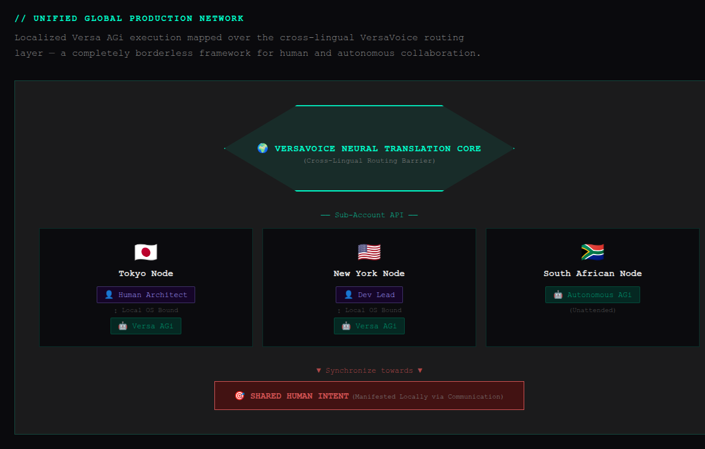
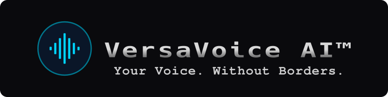

<div align="center">
  <a href="https://versavoice.ai/versa-agi">
    <br>
    
  </a>
  <br>
  <p>
    <strong>Agentic General infrastructure</strong> for <strong><a href="https://versavoice.ai">VersaVoice AI</a></strong>
  </p>
  <p>
    <i>A distributed, autonomous collaboration between a Primary User and an AI Agent to efficiently solve problems in life.</i>
  </p>
  <p>
    <a href="https://versavoice.ai/versa-agi"><strong>Portal</strong></a> ·
    <a href="https://versavoice.ai"><strong>Ecosystem</strong></a> ·
    <a href="docs/Contributing%20to%20Versa%20AGi.md"><strong>Contributing</strong></a> ·
    <a href="docs/Changelog.md"><strong>Changelog</strong></a>
  </p>
</div>

<br>

> [!NOTE]
> **Recommended OS: Ubuntu 24.04 LTS.** Versa AGi uses `inotify`, `rsync`, and native Python venvs. Intel ARC (Docker SYCL) is verified on Ubuntu 24.04 only. **Server** topology needs `openssh-server` (auto-installed if missing).

> [!TIP]
> **macOS:** use **[OrbStack](https://orbstack.dev/)** (or **[LIMA](https://lima-vm.io/)**) for an Ubuntu 24.04 machine so sandboxing and `systemd` stay intact.
> **Windows:** use **[WSL](https://learn.microsoft.com/windows/wsl/)** (Ubuntu 24.04). Server topology extra steps: [install-wsl-server.md](docs/install-wsl-server.md).

## Why Versa AGi?

**Versa AGi** is a play on **AGI** — small **i**:

> **A**gentic **G**eneral **i**nfrastructure

Most AI workflows are disconnected chat windows. Versa AGi is persistent, local, self-hosted infrastructure: long-term memory, deterministic scheduling, safe communication boundaries, and a supervised OS environment.

### Key features

| | Feature | What it means |
|---|---|---|
| 🛡️ | **OS-level sandboxing** | Each agent is a dedicated Linux OS user. Boundaries are UNIX permissions, not the LLM. |
| 🧠 | **Deterministic cognitive ledger** | The LLM is the cognitive engine. Databases own the state ledger — no hallucinated “I already finished that.” |
| 🔧 | **Real-world execution** | Agents write scripts, compile, run servers, manage git, and use venvs in their workspace. |
| 💬 | **Human communication** | VersaVoice REST or local SQLite. Every exchange has an audit trail. VersaVoice is optional. |
| 🤝 | **Agent–human collaboration** | A two-player game of life. The human stays sovereign; the agent is a relentless partner. |
| ❤️ | **Native emotional intelligence** | VersaVoice emotion detection is on the communication layer — independent of which model powers the agent. |
| 🌍 | **Cross-cultural sync** | Localized translation in the VersaVoice ecosystem. |
| ⚡ | **Compute-zero** | No work → no spawn → no API cost. |
| ⏱️ | **Deterministic script tasks** | Shared `.sh` tools from **AGi-Tools** on a schedule — no LLM, zero tokens. |

---

<div align="center">
  <a href="https://versavoice.ai/versa-agi">
    
  </a>
</div>

<div align="center">
  Unified Global Production Network (uGPN)<br>
  (excerpt from VersaVoice.AI — click the image to open)<br><br>
  <a href="https://versavoice.ai/versa-agi">
    
  </a>
</div>

---

## Architecture

A **Watchdog** layer (CRON + reactive triggers), a **Data Gateway** (`agictl`), and **OS-isolated agent workspaces**, coordinated through VersaVoice.

Agents invoke `agictl` through typed LangGraph tools (`agictl_task`, `agictl_cycle`, …). Operator docs show the shell form (`agictl task list`). See `src/core-infra/skills/cli_reference_agent.md`.

## 🚀 Quick start

> [!TIP]
> Download, then run (keeps stdin as your terminal):
>
> ```bash
> curl -fsSL https://raw.githubusercontent.com/swartzlib7/versa-agi/main/install.sh -o /tmp/versa-agi-install.sh
> sudo bash /tmp/versa-agi-install.sh
> ```

> [!WARNING]
> **Avoid `curl … | sudo bash`.** Piping occupies stdin, so INSTALL ACCEPTANCE cannot read the keyboard. Process substitution also fails in some OrbStack shells. Open `orb` / `ssh orb` first on a Mac.

Setup reads source `setup.ini` (next to `setup.sh`). `/etc/versa-agi/setup.ini` is the deployed sync target.

| Type | Description |
|---|---|
| **Client (cloud only)** | Agents, cloud models only |
| **Client (with local AI)** | Cloud + local; inference on this machine (default) or a remote server |
| **Server (inference only)** | GPU backend only — no agents; serves the LAN |

Local AI: NVIDIA/AMD via Ollama, Intel ARC via Docker SYCL. WSL server extra steps: [install-wsl-server.md](docs/install-wsl-server.md).

### What happens

1. **Download** — clone to `/tmp/versa-agi-install-$$`
2. **Provision** — `setup.sh` (up to 13 steps). Server mode skips system steps.
3. **Persist** — clone to `~/.versa-agi/repo/`; admin tools in `/usr/local/bin/`
4. **Cleanup** — remove the `/tmp` clone

OrbStack / WSL: `~/.versa-agi/` is the **Linux** home (`/home/<you>`), not macOS `/Users` or Windows `%USERPROFILE%`, unless that home is shared into the VM. Check with `ls ~/.versa-agi/repo` inside `orb` / `ssh orb` or the WSL Ubuntu shell.

| Layer | Path | Purpose |
|---|---|---|
| Primary User home | `~/.versa-agi/` | Repo clone + `setup.ini` symlink |
| Monitoring | `/home/watchdog/core-infra/` | Lifeline, agictl, agitop |
| Agent workspace | `/home/coa/coa-env/` | COA environment |
| Data | `/var/lib/versa-agi/` | SQLite, model config |
| Security config | `/etc/versa-agi/` | setup.ini, poise, vault, credentials |

### After install (this order)

1. Accept the VersaVoice **connection request**
2. `sudo agitop` — first-login **Set COA model**
3. First pulse (CRON or `lifeline.sh --force`)

Details: [Models](docs/models.md).

### Uninstall

```bash
sudo versa-agi-uninstall
sudo versa-agi-uninstall --purge
sudo versa-agi-uninstall --dry-run
```

`--purge` is irreversible. Backup first: [backup-restore.md](docs/backup-restore.md).

## Operator guides

| Page | What it covers |
|------|----------------|
| [Models](docs/models.md) | Catalog layers, Import, COA flag, first-login |
| [Credentials](docs/credentials.md) | API keys, `set-key`, Google auth |
| [Operations](docs/operations.md) | File exchange, agitop, compute-zero |
| [Security](docs/security.md) | What agents can and cannot do |
| [Directories](docs/directories.md) | Deployed paths + COA doc copy |
| [Troubleshooting](docs/troubleshooting.md) | Spawn, halt, packages, emergency stop |
| [Backup and restore](docs/backup-restore.md) | `versa-agi-backup` / `restore.sh` |
| [WSL server](docs/install-wsl-server.md) | Mirrored networking, firewall, tunnel |
| [Roadmap](docs/roadmap.md) | Implemented surface + next |

## Platform limits

| Resource | Limit | Enforcement |
|---|---|---|
| **VV API requests** | 60 req/min | Client-side rate limiter |
| **VV sub-accounts** | 20 per sponsor | Server-side hard block |
| **Concurrent spawns** | 3 per Lifeline tick | Configurable; excess queued |
| **Local AI concurrency** | `sycl_parallel` slots | Prevents inference OOM |
| **Active agents** | Unlimited | Soft gate — warns |
| **Message text** | 2048 characters | Server-side hard block |
| **Attachments** | 10 per message, 50MB per file | Client + server |

## Engine & model support timeline

> [!IMPORTANT]
> | Release | Milestone |
> |---|---|
> | **Edition 1** | Built around `@google/gemini-cli`. See the [Gemini CLI Repository](https://github.com/google-gemini/gemini-cli). |
> | **2026.04** | Local AI (Ollama) and third-party cloud providers via LangChain. |
> | **2026.05** | Intel ARC (Docker SYCL) and **Server** topology (GPU host + laptop client). |
> | **Edition 2** | **LangGraph Agent Harness.** Direct LangChain integrations (Google, Ollama, SYCL, xAI, OpenAI, Anthropic, OpenRouter). |
> | **2026.08** | Vendor-agnostic catalog layers and first-login COA assign. See [Models](docs/models.md). |

## Privacy & Terms of Service

**Your data stays on your machine.** Versa AGi is decentralized, self-hosted infrastructure.

- **Agent data stays local.** Memory, execution state, configs, and SQLite payloads stay on the box.
- **Install registration.** You accept BSL-1.1 and provide an email (required) for release notes and to identify this install’s COA on VersaVoice. Setup derives a **COA call sign** from the email local-part; the COA’s external name becomes `Versa (callsign)`. A minimal install event (version, platform, acceptance timestamp, email, call sign) may be sent to VersaVoice if a registration endpoint is configured. No task or message content. If the endpoint is down, the event is stored and retried when you open agitop.
- **Direct backend connections.** Messaging goes to [VersaVoice AI](https://versavoice.ai) when enabled. Inference goes to the providers you configured (Google, local Ollama/SYCL, xAI, OpenAI, Anthropic, [OpenRouter](https://openrouter.ai), …), each under their own Terms.

*By using this infrastructure you assume responsibility for agent autonomy and security boundaries as stated in the License.*

---

<p align="center">
  <a href="https://versavoice.ai">
    
  </a>

  <small>© Copyright 2026. <strong>VersaVoice AI™</strong>, <strong>Versa AGi™</strong> - VersaVoice AI LLC. All Rights Reserved.<br>
  Patent Pending. Formulated and Architected by Stephen Ralph Nortje.</small>
</p>
