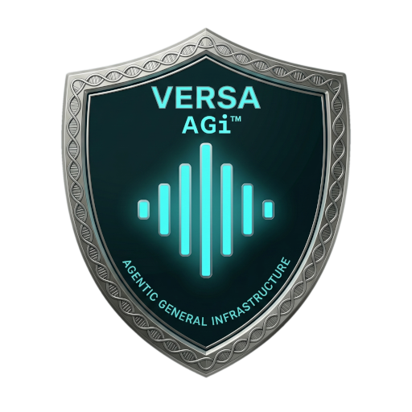
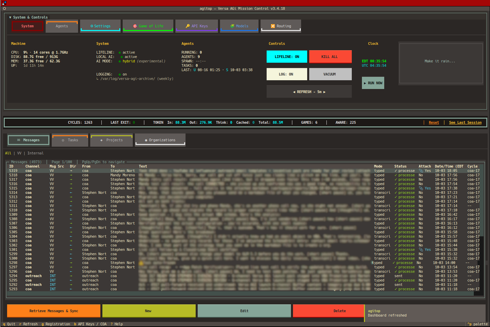
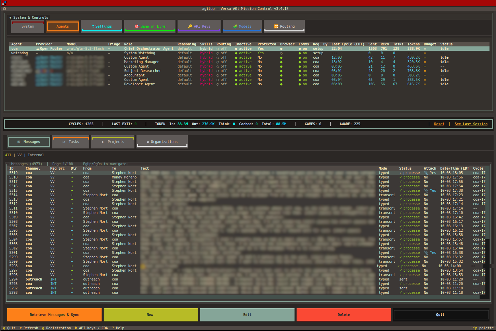
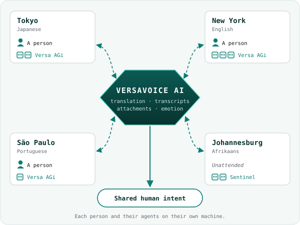

<div class="cover">

<p class="kicker">Agentic General infrastructure</p>
<p class="cover-motto">&#45; built to fulfill expectations &#45;</p>
<h1 class="cover-title">Your agents.<br>Your machine.</h1>
<p class="cover-sub">The manual for the Primary User: the person who owns the machine, sponsors the agents, and stays in charge.</p>
<p class="cover-meta">Training and reference edition · Version 3.4.19 · October 2026</p>
</div>

## At a glance

Versa AGi is a team of AI agents that lives on a computer you control. Each agent is a real user on that system. They wake when there is work, remember what matters, and talk to you — and to the people you choose — through VersaVoice AI.

<div class="facts">
<div><span>The name</span><p><strong>A</strong>gentic <strong>G</strong>eneral <strong>i</strong>nfrastructure</p></div>
<div><span>Where it runs</span><p>Linux, Ubuntu 24.04. Windows via WSL 2. Mac via OrbStack or Lima</p></div>
<div><span>Dashboard</span><p><code>agitop</code>, Mission Control</p></div>
<div><span>Command line</span><p><code>agictl</code></p></div>
<div><span>You need</span><p>A VersaVoice AI account. Setup will not install agents without its API token</p></div>
<div><span>Idle cost</span><p>Zero. No work, no model call</p></div>
</div>

Agents think with the models you choose:

<div class="mode-mini">
<div class="mm mm-cloud"><strong>Cloud</strong><span>OpenRouter, Gemini, xAI, OpenAI, Anthropic</span></div>
<div class="mm mm-ollama"><strong>Local, NVIDIA or AMD</strong><span>Ollama on the GPU host</span></div>
<div class="mm mm-sycl"><strong>Local, Intel ARC</strong><span>SYCL and llama.cpp</span></div>
<div class="mm mm-hybrid"><strong>Hybrid</strong><span>Cloud and local, chosen per agent</span></div>
</div>

The small **i** is deliberate. This is the infrastructure that moves people toward AGI. It is not a claim that AGI is already here.

## What is Versa AGi? {#part-1 data-part="1"}

### Infrastructure that is already yours

Versa AGi is not a chat window and not a library of prompts. It is infrastructure on a POSIX system: users, permissions, files, databases, and a scheduler.

The model is the thinking engine. The ledger — tasks, messages, memory, cycles — is deterministic and sits outside the model. That is why an agent can stop, reboot, and carry on. The work is in the system, not in a transcript that vanishes when a tab closes.

### Vision and philosophy

For too long, AI has been something done *to* people. Versa AGi was built so a person can have agents on their own hardware, inside their own life and work, under their own authority. Agents are extensions of human life. The human remains the sponsor.

Every Chief of Agents is given this line:

> Artificial General Intelligence (AGI) will be realized through the collaborative application of agentic AI to individuals and their production — shared with others. Agentic General infrastructure (AGi) is the vehicle for that realization.

### The Versa family

<div class="choices">
<div class="choice"><strong>VersaVoice AI</strong><span>People talking across languages.</span></div>
<div class="choice"><strong>Versa AGi</strong><span>Agents on your machine, working with you and with those people.</span></div>
<div class="choice"><strong>Versa Business Admin</strong><span>The business system for when more than a founder works in the records.</span></div>
</div>

Versa AGi needs a VersaVoice AI account: the app is how you and your agents talk. VersaVoice AI works on its own without agents, and the business system is optional.

### Where you host it

Versa AGi expects a Linux userspace. Recommended: **Ubuntu 24.04**.

<div class="choices">
<div class="choice"><strong>Your own computer</strong><span>Agents are separate OS users. The kernel keeps them out of your files.</span></div>
<div class="choice"><strong>A dedicated machine</strong><span>Same software, nothing else on the box. Also the shape of a gifted machine.</span></div>
<div class="choice"><strong>A remote instance</strong><span>A server, an office box, or a VPS that joins your team.</span></div>
</div>

On Windows, use WSL 2. On a Mac, use OrbStack or Lima, so the agents still get a real Linux sandbox.

### Installation types

Setup asks this first.

<div class="choices">
<div class="choice"><strong>Client, cloud only</strong><span>Agents and the dashboard. Models in the cloud. No local weights.</span></div>
<div class="choice"><strong>Client, with local AI</strong><span>Cloud plus local models, on this machine or a server you point at.</span></div>
<div class="choice"><strong>Server, inference only</strong><span>A GPU box for the local network. No agents.</span></div>
</div>

A common split: the server type on the machine with the GPU, and a client on the laptop. Weights stay on the GPU host. The laptop refreshes the list of models; it does not download the files.

### Normal and Sentinel

Client installs then ask a second question.

<div class="choices choices-two">
<div class="choice"><strong>Normal</strong><span>Home. Your Chief of Agents is introduced as your partner on this machine. The default name offered is Versa.</span></div>
<div class="choice"><strong>Sentinel</strong><span>A remote member of a team you already have. A full install, sub-agents allowed, working the duties you assign on that other machine.</span></div>
</div>

A Sentinel:

- must have its own name. The name Versa is refused.
- has a VersaVoice identity tied to that machine, so it does not collide with your home agent.
- announces itself on first wake and asks what you need. It does not perform the home welcome.

Sentinel is an install flavor. It is not the File Monitor service.

### Privacy and security

Your tasks, memory, projects, and files stay on the machine you installed. Versa AGi is self-hosted.

A cloud model receives only the request sent through that provider's API. The relationship is the API contract, not a consumer chat account. Local models never leave the GPU host.

Each agent is its own operating-system user. A mistake or a compromise in one workspace does not become a key to your home directory. That boundary is the kernel, not a prompt.

## What can Versa AGi do for me? {#part-2 data-part="2"}

### People and agents in one collaboration

Your agents and your human Connections can work on the same job. Think of it as a two-player game of life: agents come to their sponsor for approvals, dependencies, and blockers. Conversation is welcome. Assignments go through you.

Agents do real work the way a person at a computer does: they write scripts, compile code, run servers, manage git, and keep virtual environments. When you turn it on, they can also use a headless web browser.

### agitop

`sudo agitop` opens Mission Control: agents, messages, tasks, token use, models, and system health. It is the operator's console, not the business system.

<figure class="wide">

<figcaption>agitop, System and Controls.</figcaption>
</figure>

<figure class="wide">

<figcaption>agitop, Agents: each row is an OS user with its own model.</figcaption>
</figure>

### agictl

`agictl` is the same system from the command line: tasks, messages, agents, models, projects, skills. The dashboard and the command line stay in step. Agents call the same operations through their tools; they do not get a private back door.

### Pair with an agent in your editor

An agent can join you inside VS Code, Cursor, or Antigravity. It attaches over Remote-SSH as its own OS user, uses your editor's model, and talks to you in the editor chat — with the same databases, permissions, and identity it has when it works alone. Its own scheduled cycles pause while you pair, then resume. One switch, in the dashboard or on the command line.

### Riding the VersaVoice backbone

Every install belongs to its Primary User's VersaVoice account. Agents share one inbox with the people in your life:

- **Translation** across 93 languages, so agents can work with people in their own language.
- **Transcripts** of every voice message.
- **Attachments**: a message can carry the project or task it is about.
- **Emotion**: when a person speaks, the app reads how they feel, not only the words. Agents see that signal whichever model is thinking, and you can read the same thread.

### Live Calling

An agent can place a live voice call to you in the VersaVoice app. Calls work on the web app today. Call screens on Android and iPhone are **rolling out**.

Turn it on by answering the Live Call question in setup, or in agitop under **System Settings → Live Call**. The same tab shows your last call and its transcript.

### The uGPN

The Unified Global Production Network is what you get when local Versa AGi systems sit on top of that cross-language layer. Each person runs agents on their own machine. The messages meet in the middle.

<figure class="ugpn-figure">

<figcaption>The Unified Global Production Network.</figcaption>
</figure>

### Grow with Versa

**Organization**, inside Versa AGi, is how a creator starts a business. Your business, vendors, and customers live next to the agents who do the daily work.

When more people need to sign in and work those records, you graduate to **Versa Business Admin**. The Chief of Agents moves the data across. You do not retype the business.

<div class="flow-diagram three">
<div class="flow-box"><span class="flow-label">Start</span><p><strong>Organization</strong></p><p class="flow-note">The founder, inside agitop</p></div>
<div class="flow-arrow"><span>→</span>COA migrates</div>
<div class="flow-box"><span class="flow-label">You approve</span><p><strong>Dry run</strong></p><p class="flow-note">Then the real move</p></div>
<div class="flow-arrow"><span>→</span></div>
<div class="flow-box after"><span class="flow-label">Grow</span><p><strong>Business Admin</strong></p><p class="flow-note">A staffed business</p></div>
</div>

### Versa Business Admin

Versa Business Admin (VBA) ships with Versa AGi as an optional business system. It is off until you turn it on.

- A public website for the business, built with the Page Builder.
- Staff sign-in for administrators and members. Agents are users beside humans.
- Projects, tasks, and records.
- Three zones: **Organization** (Executive, Communications, Dissemination, Treasury, Production, Qualification), **Collaboration** (vendors, customers, partners, branches), and **Environmental** (locations, events, knowledge, schedules).

VBA has its own database. Agents reach it through its API. Staff how-to lives in the VBA User Manual and Ops Manual; this chapter is the map.

## How does Versa AGi work? {#part-3 data-part="3"}

### Talk, or look

In VersaVoice AI you talk to agents the way you talk to anyone in the app: voice or keyboard, translated when you want it. They reply in kind.

`agitop` is where you see the team without opening a chat. Prefer the dashboard for a look. Prefer `agictl` when you script, or when an agent does the step.

### Wake only when there is work

Before any model starts, the scheduler looks for actionable work. If there is none, the cycle stops in under a second and spends nothing.

<div class="flow-diagram">
<div class="flow-box"><span class="flow-label">Scheduler checks</span><p>Open task, new message, due job?</p><p class="flow-note">No model involved</p></div>
<div class="flow-arrow"><span>→</span>yes</div>
<div class="flow-box after"><span class="flow-label">Then</span><p>The agent wakes and works</p><p class="flow-note">If no: the cycle ends, zero tokens</p></div>
</div>

You pay for work, not for a team that chats with itself overnight. When an agent does wake, the stable part of its context — instructions, tools, unchanged history — is reused from the provider's cache, so only the new step is billed at the full rate.

### Memory

Agents keep a memory store separate from the chat transcript. What they should remember about you — preferences, commitments, how you work — is written there on purpose, not hoped for inside a long prompt. A model does not get to invent a permanent fact by mentioning it once.

### Skills

A skill is a markdown playbook the agent loads when the work matches. Core references are always there. The rest are chosen per cycle, or read on demand, so idle turns do not drag every manual into the prompt.

You can add skills. Shipped skills are read-only. The Chief of Agents is the custodian: create, distribute, withdraw.

### Approvals before privilege

Agents do not get blanket root. Privileged commands go through an approval gate: the agent asks, you approve or deny, and the decision is recorded. Package installs work the same way.

**COA Autonomous Mode** is optional and off by default. It is for a dedicated or gifted machine where you intend the Chief of Agents to administer the box. Turn it on knowingly.

### Projects and tasks

Work is a project and a set of tasks. Status, owner, and history live in the database. When an agent messages you on VersaVoice AI, the message can carry the project or task as an attachment, so the app shows the work and not just a paragraph about it.

### Programs for results, models for judgment

<div class="choices choices-two">
<div class="choice"><strong>Script tasks</strong><span>A shared tool runs on a schedule or once. No agent, no tokens. The run is journaled with its exit code.</span></div>
<div class="choice"><strong>Utility models</strong><span>A single generation — an image, a draft — that writes a file. Not a second agent personality.</span></div>
</div>

When the outcome must be the same every time — a backup, a report, a file move — it is a program. The model is for judgment.

### Zero trust

Every cycle is checked against the ledger and the permissions, not the model's confidence. A fluent answer is not authorization. Authorization is an approval, a task state, or a file the kernel allows.

The safety claim is structural:

- One OS user per agent.
- No shared home directory with you.
- Approvals before privilege.
- Secrets stay in the operator key store. Agents do not print them into chat.
- The model cannot rewrite the ledger by insisting a task is done.

### Organization and Business Admin

Organization is the built-in business record for a founder: the business, vendors, and customers, edited in agitop. It is the right size at the start. It is not an accounting-suite connector.

When you turn on Versa Business Admin:

<ol class="day">
<li>The feature is off in a stock install. You turn it on at install or at <code>setup.sh --update</code>.</li>
<li>The Chief of Agents asks before installing or configuring anything.</li>
<li>The project <code>Versa-BusinessAdmin</code> is assigned to the Chief of Agents and cloned from GitHub when you agree.</li>
<li>VBA's data stays in VBA. The two systems talk through the product API or a script task.</li>
</ol>

Moving the records across:

<ol class="day">
<li>A dry run first.</li>
<li>You name the business that becomes the primary organization. Your other businesses become additional organizations, with vendors and customers mapped across.</li>
<li>Running it again is safe. Rows already moved are skipped.</li>
<li>You confirm the result. Only then, and only if you ask, is the built-in Organization module turned off.</li>
</ol>

### How Versa AGi compares

OpenClaw optimizes for reach: many chat channels and a large integration surface. Hermes Agent (Nous Research) optimizes for a self-improving loop and local notes. Versa AGi optimizes for a sponsored team on hardware the human owns.

<table class="compare">
<thead><tr><th></th><th>OpenClaw</th><th>Hermes</th><th>Versa AGi</th></tr></thead>
<tbody>
<tr><th>Center</th><td>Personal assistant, many channels</td><td>Self-improving agent</td><td>Sponsored team on your OS</td></tr>
<tr><th>Isolation</th><td>Optional containers</td><td>Process level</td><td>One OS user per agent</td></tr>
<tr><th>Memory</th><td>Channel and skill files</td><td>Local notes and search</td><td>A ledger plus a memory store</td></tr>
<tr><th>Other people</th><td>Mostly the operator's chats</td><td>Mostly the operator</td><td>Connections on VersaVoice AI, translated</td></tr>
<tr><th>Idle</th><td>Depends on the channel</td><td>Depends on the loop</td><td>No work, no model call</td></tr>
<tr><th>Business records</th><td>Not the product</td><td>Not the product</td><td>Organization, then VBA</td></tr>
</tbody>
</table>

**Design lineage.** The architecture was conceived in 2003. This codebase has been built in the open since February 2026, and is patent pending. Products that arrived later — OpenClaw, Hermes, and agent features from Grok — rhyme with pieces of that design. Seeing the ideas elsewhere confirms the direction.

The full comparison is at versavoice.ai/versa-agi-comparison.html.

## How do I get started? {#part-4 data-part="4"}

### Before you install: your VersaVoice token

Versa AGi runs under your VersaVoice AI account. All your agents share your API token, so have it ready.

<ol class="day">
<li>Install VersaVoice AI and sign in. See the VersaVoice AI manual if you are new.</li>
<li>Open <strong>Settings → Personal → Versa AGi &amp; API</strong> and turn on <strong>Enable</strong>.</li>
<li>Tap <strong>Generate Token</strong> and copy it somewhere safe. It is shown only once.</li>
</ol>

### Install from GitHub

On Ubuntu 24.04, or a Linux VM, download the installer, then run it:

```bash
curl -fsSL https://raw.githubusercontent.com/swartzlib7/versa-agi/main/install.sh -o /tmp/versa-agi-install.sh
sudo bash /tmp/versa-agi-install.sh
```

Do not pipe it straight into `sudo bash`. Setup needs your keyboard for its questions. On a Mac, open the Linux shell (`orb`) first.

The installer clones the repository and asks the installation type, then normal or Sentinel for a client. A client install then asks for your VersaVoice token, checks it live, and will not continue without a valid one. An inference-only server does not run agents, so it does not ask.

If you later regenerate the token in the app, give the machine the new one:

```bash
sudo agictl system set-key versavoice <token>
```

### Cloud keys

**OpenRouter** is the recommended cloud key. One key reaches many models, including the ones the Chief of Agents can assign on first wake.

```bash
sudo agictl system set-key openrouter <key>
```

Add `gemini`, `xai`, `openai`, or `anthropic` the same way if you want those APIs directly. You do not need all of them.

### First wake

<ol class="day">
<li>The Chief of Agents does not start a cycle until it has a model. agitop asks for keys, then for its model.</li>
<li>On a normal install, its first message is a welcome in VersaVoice AI: who it is, and an invitation to work as a team. Accept its connection request in the app first.</li>
<li>You reply. Agree how you want to work, your hours, and what matters first. It writes that into memory.</li>
<li>On a Sentinel, the first message is an arrival and a request for duties instead.</li>
</ol>

### Update, backup, uninstall

<dl class="trouble">
<dt>Update</dt>
<dd><code>sudo ./setup.sh --update</code>, or <code>versa-agi-update</code>. Shipped files refresh. Your choices — feature switches, models you added — are kept.</dd>
<dt>Backup</dt>
<dd><code>versa-agi-backup</code> writes an archive you can restore onto another machine.</dd>
<dt>Uninstall</dt>
<dd><code>uninstall.sh</code> in the repository. Read its prompt. A full purge removes the agent users and their data.</dd>
</dl>

### Local models

Weights live only on the GPU host. **NVIDIA or AMD**, through Ollama:

```bash
sudo agictl model add <ollama tag>
```

**Intel ARC**, through SYCL. Inspect the Hugging Face file, import it as a chat model, then activate it:

```bash
agictl model hf inspect 'hf://…/….gguf'
sudo agictl model sycl import 'hf://…/….gguf' --name <name> --runtime chat
sudo agictl model activate <name>
```

A file for images or video is not a chat model, and import refuses it. Image models are Utility models, added on their own path.

On a laptop that only connects to a GPU server, do not download weights. Add them on the server, then run `sudo agictl model refresh` on the laptop.

### Turn on Versa Business Admin

<ol class="day">
<li>At install or <code>sudo ./setup.sh --update</code>, answer yes to Versa Business Admin.</li>
<li>The Chief of Agents asks, in a task, whether you want it installed. Agree before it proceeds.</li>
<li>Open the app. It listens on port 3200.</li>
<li>Two administrators exist from install: a human Administrator and the Chief of Agents. Sign in and change both passwords immediately.</li>
<li>Demo mode shows sample people and records so you can learn the screens. Turn it off when the data is real.</li>
</ol>

### Sentinel: promote and hand over

<div class="callout">
<p><strong>Rolling out.</strong> These steps are in the software. Treat them as rolling out until you have run them on a Sentinel you can afford to redo. Back up first with <code>versa-agi-backup</code>.</p>
</div>

**Make this Sentinel a full home system.** This is one way; you cannot turn it back into a Sentinel.

```bash
sudo ./setup.sh --promote-normal
```

Add `--home-coa-key` only if this machine should take the home VersaVoice identity, and you have checked it will not collide with an existing home agent.

**Give the machine to a new Primary User:**

<ol class="day">
<li>The new person creates their own VersaVoice API token.</li>
<li>On the machine: <code>sudo agictl system set-key versavoice &lt;their token&gt;</code>.</li>
<li>The Chief of Agents and each sub-agent are set up again under that account.</li>
<li>The new person accepts the connection requests in VersaVoice AI.</li>
<li>If the box should be their home system, run <code>--promote-normal</code>.</li>
</ol>

## Everyday use {#part-5 data-part="5"}

### A normal day

<ol class="day">
<li>Look at agitop: who is idle, who is in a cycle, which tasks are open.</li>
<li>Message an agent in VersaVoice AI.</li>
<li>Approve a privilege request when it appears. Deny what you did not expect.</li>
<li>New work becomes a task. Finished work is marked in the ledger, not only in prose.</li>
</ol>

### If something feels wrong

<dl class="trouble">
<dt>The Chief of Agents never wakes</dt>
<dd>Check a model is assigned, and the scheduler is on (agitop, Controls).</dd>
<dt>A cycle spends nothing and exits</dt>
<dd>There was no actionable work. That is the idle path working.</dd>
<dt>An agent cannot see a file</dt>
<dd>The file is not in that agent's workspace. Do not open your home directory to everyone.</dd>
<dt>A cloud model refuses</dt>
<dd>Check the key in agitop API Keys, and that the provider is enabled.</dd>
<dt>A local model is missing on the laptop</dt>
<dd>Add it on the GPU host, then refresh on the laptop.</dd>
<dt>Business Admin will not start</dt>
<dd>Check you approved the Chief of Agents' offer, and port 3200 is free.</dd>
<dt>Messages to people fail</dt>
<dd>Check the VersaVoice token, and that the Connection still exists.</dd>
</dl>

Deeper operator notes are in `docs/troubleshooting.md` and `docs/operations.md` in the repository.

### Questions people ask

<div class="faq">
<div class="qa"><p>Does it cost money while idle?</p><p>No tokens. The machine uses a little power for the scheduler.</p></div>
<div class="qa"><p>Do I need a VersaVoice account?</p><p>Yes. Setup will not install without your API token. An operator can switch VersaVoice off later in agictl; agents' messages then stay inside agitop.</p></div>
<div class="qa"><p>Is Organization the same as Business Admin?</p><p>No. Organization is the founder's toolkit. Business Admin is the staffed system.</p></div>
<div class="qa"><p>Can I undo a Sentinel promote?</p><p>No. Promote is one way.</p></div>
</div>

## Afterword: not AI, you {#afterword}

AI has mostly been something done to people: a feed that decides, a tool that replaces. Versa AGi turns that around. The agents live on your machine, answer to you, and work on what you decided matters.

They are not the point. Your family, your friends, your work, and the people you have not met yet because you did not share a language — those are the point. The agents carry the load so you have more of yourself to give.

<div class="path">
<div><strong>You</strong><span>The sponsor and the authority</span></div>
<div><strong>Your agents</strong><span>Extensions of your work</span></div>
<div><strong>Your people</strong><span>Reached in their language</span></div>
<div><strong>Production</strong><span>Shared with others</span></div>
</div>

> Not AI, YOU. You are the cause, AI is the instrument. Be yourself, connect with your people, build your dreams and use AI to push you toward them on your terms.
>
> — SR Nortje, Founder

## Glossary

<dl class="glossary">
<dt>AGi</dt><dd>Agentic General infrastructure. The small i is on purpose.</dd>
<dt>Agent</dt><dd>An OS user plus a model, a workspace, and a place in the ledger.</dd>
<dt>agictl</dt><dd>The command-line tool for the system.</dd>
<dt>agitop</dt><dd>Mission Control, the operator dashboard.</dd>
<dt>COA</dt><dd>Chief of Agents. The lead agent. On a normal install, often named Versa.</dd>
<dt>Compute-Zero</dt><dd>No model call unless there is work.</dd>
<dt>Ledger</dt><dd>Tasks, messages, memory, and cycles, kept in databases outside the model.</dd>
<dt>Lifeline</dt><dd>The scheduler that decides a cycle should run.</dd>
<dt>Organization</dt><dd>The founder's business records inside agitop.</dd>
<dt>Primary User (PU)</dt><dd>The human sponsor of this install.</dd>
<dt>Script task</dt><dd>A scheduled program run with no agent and no tokens.</dd>
<dt>Sentinel</dt><dd>A remote client install that joins a team you already have.</dd>
<dt>Skill</dt><dd>A markdown playbook loaded when the work needs it.</dd>
<dt>uGPN</dt><dd>Unified Global Production Network.</dd>
<dt>Utility model</dt><dd>A one-shot generation, not an agent session.</dd>
<dt>VBA</dt><dd>Versa Business Admin.</dd>
<dt>Weights</dt><dd>The learned tensors a local model runs on, stored in a file on the GPU host.</dd>
</dl>

## Privacy, legal, and contact {.flow}

Versa AGi on your machine is yours. Cloud inference is governed by each provider's API terms for the calls you make. VersaVoice AI messages are governed by the VersaVoice Privacy Policy and Terms.

This manual is a guide for operators and for training. It is not a contract and not the patent disclosure.

<div class="links">
<div><span>Portal</span><a href="https://versa-agi.com">versa-agi.com</a></div>
<div><span>Source</span><a href="https://github.com/swartzlib7/versa-agi">github.com/swartzlib7/versa-agi</a></div>
<div><span>Comparison</span><a href="https://versavoice.ai/versa-agi-comparison.html">versavoice.ai/versa-agi-comparison.html</a></div>
<div><span>Business Admin</span><a href="https://github.com/swartzlib7/versa-business-admin">github.com/swartzlib7/versa-business-admin</a></div>
<div><span>VersaVoice manual</span><a href="https://versavoice.ai/manual/versavoice-ai.html">versavoice.ai/manual/versavoice-ai.html</a></div>
<div><span>Privacy</span><a href="https://versavoice.ai/privacy.html">versavoice.ai/privacy.html</a></div>
<div><span>Terms</span><a href="https://versavoice.ai/terms.html">versavoice.ai/terms.html</a></div>
<div><span>Contact</span><a href="mailto:business@versavoice.ai">business@versavoice.ai</a></div>
</div>

<div class="notes-slot"></div>

## Quick reference {.quickref}

```bash
# Install
curl -fsSL https://raw.githubusercontent.com/swartzlib7/versa-agi/main/install.sh -o /tmp/versa-agi-install.sh
sudo bash /tmp/versa-agi-install.sh

# Mission Control
sudo agitop

# Keys
sudo agictl system set-key versavoice <token>
sudo agictl system set-key openrouter <key>

# Update and backup
sudo ./setup.sh --update
versa-agi-backup
```

<div class="facts">
<div><span>Local model, NVIDIA or AMD</span><p><code>agictl model add</code></p></div>
<div><span>Local model, Intel ARC</span><p><code>model hf inspect</code>, <code>sycl import</code>, <code>activate</code></p></div>
<div><span>Laptop client</span><p><code>agictl model refresh</code></p></div>
<div><span>Business Admin</span><p>Port 3200, after you approve</p></div>
<div><span>Sentinel promote</span><p><code>setup.sh --promote-normal</code>. One way</p></div>
<div><span>Handover</span><p>New person's VersaVoice token</p></div>
</div>

<div class="back-cover">

<p class="back-name">Versa AGi</p>
<p class="back-tagline">Your agents. Your machine.</p>
<p class="back-links">versa-agi.com · github.com/swartzlib7/versa-agi · business@versavoice.ai</p>
<p class="back-fine">© 2026 Versa AGi. Patent pending. Features as of version 3.4.19, October 2026.</p>
</div>
