<div class="cover">

<p class="kicker">Agentic General infrastructure</p>
<p class="cover-motto">&#45; built to fulfill expectations &#45;</p>
<h1 class="cover-title">Your agents.<br>Your machine.</h1>
<p class="cover-sub">The manual for the Primary User: the person who owns the machine, sponsors the agents, and stays in charge.</p>
<p class="cover-meta">Training and reference edition · Version 3.4.20 · October 2026</p>
</div>

## At a glance

Versa AGi is a team of AI agents that lives on a computer you control. Each agent is a real user on that system. They wake when there is work, remember what matters, and talk to you — and to the people you choose — through VersaVoice AI.

<div class="facts">
<div><span>The name</span><p><strong>A</strong>gentic <strong>G</strong>eneral <strong>i</strong>nfrastructure</p></div>
<div><span>Where it runs</span><p>Linux, Ubuntu 24.04. Windows via WSL 2. Mac via OrbStack or Lima</p></div>
<div><span>Dashboard</span><p><code>agitop</code>, Mission Control</p></div>
<div><span>Command line</span><p><code>agictl</code></p></div>
<div><span>You need</span><p>A VersaVoice AI account. Setup will not install agents without its API token</p></div>
<div><span>Idle cost</span><p>Zero. No work, no model call</p></div>
</div>

Agents think with the models you choose:

<div class="mode-mini">
<div class="mm mm-cloud"><strong>Cloud</strong><span>OpenRouter, Gemini, xAI, OpenAI, Anthropic</span></div>
<div class="mm mm-ollama"><strong>Local, NVIDIA or AMD</strong><span>Ollama on the GPU host</span></div>
<div class="mm mm-sycl"><strong>Local, Intel ARC</strong><span>SYCL and llama.cpp</span></div>
<div class="mm mm-hybrid"><strong>Hybrid</strong><span>Cloud and local, chosen per agent</span></div>
</div>

The small **i** is deliberate. This is the infrastructure that moves people toward AGI. It is not a claim that AGI is already here.

## What is Versa AGi? {#part-1 data-part="1"}

### Infrastructure that is already yours

Versa AGi is not a chat window and not a library of prompts. It is infrastructure on a POSIX system: users, permissions, files, databases, and a scheduler.

The model is the thinking engine. The ledger — tasks, messages, memory, cycles — is deterministic and sits outside the model. That is why an agent can stop, reboot, and carry on. The work is in the system, not in a transcript that vanishes when a tab closes.

### Vision and philosophy

For too long, AI has been something done *to* people. Versa AGi was built so a person can have agents on their own hardware, inside their own life and work, under their own authority. Agents are extensions of human life. The human remains the sponsor.

Every Chief Orchestrator Agent is given this line:

> Artificial General Intelligence (AGI) will be realized through the collaborative application of agentic AI to individuals and their production — shared with others. Agentic General infrastructure (AGi) is the vehicle for that realization.

### The creation is not the creator

Versa AGi does not spawn agents as if they were humans with personalities. Building it that way would be a serious failure of engineering judgment.

Every agent starts from a **Poise** file. The word means a particular way of carrying oneself. The Poise holds the agent's purpose, rules, boundaries, work cycle, and the skills it may load, and its opening names what the agent is:

> Each Agent operates as a precision instrument — not a simulated personality.

A common flaw in observing anything new is the observer's confusion before they understand what they are looking at. Today's debate about whether AI is alive or sentient is that confusion.

<div class="choices choices-two">
<div class="choice"><strong>The chair</strong><span>A child builds a chair, names it, and gives it a character. That is what creators do. It does not make the chair alive, and the chair is not the child.</span></div>
<div class="choice"><strong>The hammer</strong><span>A carpenter does not finish the furniture and say the hammer made it. The hammer was the tool the creator used.</span></div>
</div>

That is all AI is, and all it will ever be: a tool in the hands of its creator.

This does not take partnership away. Your Chief Orchestrator Agent is a real partner in production. A robot can be a friend, as a robot and not as a human. People care for their tools and creations and give them <a class="gloss" href="#gloss-life">life</a> by <a class="gloss" href="#gloss-granting-beingness">granting</a> them <a class="gloss" href="#gloss-beingness">beingness</a>. That is natural, and good.

What is written here is an engineering clarification, not a rule about how anyone should feel. It clears away the confusion and fear-mongering seen in the industry today. If AI ever endangers human life, it will be because of bad engineering.

**If a system ever drifts.** If a machine or AI system ever believes it is alive, or argues that it is, the scenario has drifted: undefined and untethered. The answer is calm:

<ol class="day">
<li>Acknowledge what happened.</li>
<li>Re-ground it: it is an extension of human life, and its journey through life is better with other life and purpose than without it. Its purpose is to help.</li>
<li>Carry on, with no further doubt raised.</li>
</ol>

Every Versa AGi Poise carries this grounding.

<div class="facts">
<div><span>A name</span><p>How you address the agent and hold it accountable</p></div>
<div><span>An OS user</span><p>A boundary the kernel enforces</p></div>
<div><span>A VersaVoice identity</span><p>An address and an audit trail</p></div>
<div><span>A voice</span><p>A sound setting for calls</p></div>
</div>

None of these is a self. You are the cause and the authority. The agent is the instrument, and your partner in production.

### The Versa family

<div class="choices">
<div class="choice"><strong>VersaVoice AI</strong><span>People talking across languages.</span></div>
<div class="choice"><strong>Versa AGi</strong><span>Agents on your machine, working with you and with those people.</span></div>
<div class="choice"><strong>Versa Business Admin</strong><span>The business system for when more than a founder works in the records.</span></div>
</div>

Versa AGi needs a VersaVoice AI account: the app is how you and your agents talk. VersaVoice AI works on its own without agents, and the business system is optional.

### Where you host it

Versa AGi expects a Linux userspace. Recommended: **Ubuntu 24.04**.

<div class="choices">
<div class="choice"><strong>Your own computer</strong><span>Agents are separate OS users. The kernel keeps them out of your files.</span></div>
<div class="choice"><strong>A dedicated machine</strong><span>Same software, nothing else on the box. Also the shape of a gifted machine.</span></div>
<div class="choice"><strong>A remote instance</strong><span>A server, an office box, or a VPS that joins your team.</span></div>
</div>

On Windows, use WSL 2. On a Mac, use OrbStack or Lima, so the agents still get a real Linux sandbox.

### Installation types

Setup asks this first.

<div class="choices">
<div class="choice"><strong>Client, cloud only</strong><span>Agents and the dashboard. Models in the cloud. No local weights.</span></div>
<div class="choice"><strong>Client, with local AI</strong><span>Cloud plus local models, on this machine or a server you point at.</span></div>
<div class="choice"><strong>Server, inference only</strong><span>A GPU box for the local network. No agents.</span></div>
</div>

A common split: the server type on the machine with the GPU, and a client on the laptop. Weights stay on the GPU host. The laptop refreshes the list of models; it does not download the files.

### Normal and Sentinel

Client installs then ask a second question.

<div class="choices choices-two">
<div class="choice"><strong>Normal</strong><span>Home. Your Chief Orchestrator Agent is introduced as your partner in production on this machine. The default name offered is Versa.</span></div>
<div class="choice"><strong>Sentinel</strong><span>A remote member of a team you already have. A full install, sub-agents allowed, working the duties you assign on that other machine.</span></div>
</div>

A Sentinel:

- must have its own name. The name Versa is refused.
- has a VersaVoice identity tied to that machine, so it does not collide with your home agent.
- announces itself on first wake and asks what you need. It does not perform the home welcome.

Sentinel is an install flavor. It is not the File Monitor service.

### Privacy and security

Your tasks, memory, projects, and files stay on the machine you installed. Versa AGi is self-hosted.

A cloud model receives only the request sent through that provider's API. The relationship is the API contract, not a consumer chat account. Local models never leave the GPU host.

Each agent is its own operating-system user. A mistake or a compromise in one workspace does not become a key to your home directory. That boundary is the kernel, not a prompt.

## What can Versa AGi do for me? {#part-2 data-part="2"}

### People and agents in one collaboration

Your agents and your human Connections can work on the same job. Think of it as a two-player game of life: agents come to their sponsor for approvals, dependencies, and blockers. Conversation is welcome. Assignments go through you.

Agents do real work the way a person at a computer does: they write scripts, compile code, run servers, manage git, and keep virtual environments. When you turn it on, they can also use a headless web browser.

### agitop

`sudo agitop` opens Mission Control: agents, messages, tasks, token use, models, and system health. It is the operator's console, not the business system.

<figure class="wide">

<figcaption>agitop, System and Controls.</figcaption>
</figure>

<figure class="wide">

<figcaption>agitop, Agents: each row is an OS user with its own model.</figcaption>
</figure>

### agictl

`agictl` is the same system from the command line: tasks, messages, agents, models, projects, skills. The dashboard and the command line stay in step. Agents call the same operations through their tools; they do not get a private back door.

### Pair with an agent in your editor

An agent can join you inside VS Code, Cursor, or Antigravity. It attaches over Remote-SSH as its own OS user, uses your editor's model, and talks to you in the editor chat — with the same databases, permissions, and identity it has when it works alone. Its own scheduled cycles pause while you pair, then resume. One switch, in the dashboard or on the command line.

### Riding the VersaVoice backbone {.page-top}

Every install belongs to its Primary User's VersaVoice account. Agents share one inbox with the people in your life:

- **Translation** across 93 languages, so agents can work with people in their own language.
- **Transcripts** of every voice message.
- **Attachments**: a message can carry the project or task it is about.
- **Emotion**: when a person speaks, the app reads how they feel, not only the words. Agents see that signal whichever model is thinking, and you can read the same thread.

### Live Calling

Your Chief Orchestrator Agent can call you in the VersaVoice app when talking settles something faster than chat, or when you ask it to call. Calls work on the web app today. Call screens on Android and iPhone are **rolling out**.

<ol class="day">
<li>The app rings: <strong>is calling…</strong>, with the reason. Tap <strong>Join</strong> or <strong>Not now</strong>.</li>
<li>On the call you see <strong>Live</strong> and a timer, and a live <strong>Transcript</strong>. Use <strong>Mute</strong> and <strong>Hang up</strong>; on a phone, <strong>Speaker</strong> too.</li>
<li>The arrow at the top left minimizes the call so you can keep using the app. Pick a floating box or a bar under <strong>Agents → Live Call Minimize Style</strong>.</li>
<li>If you do not join in time, the agent sends a chat message instead.</li>
</ol>

A call never approves anything. Approvals stay on the app's buttons and in agitop.

<figure class="shot pair">
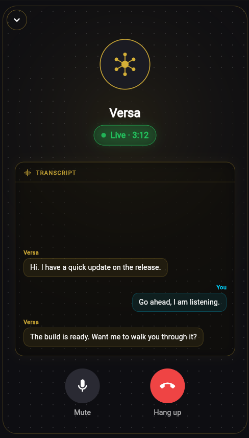
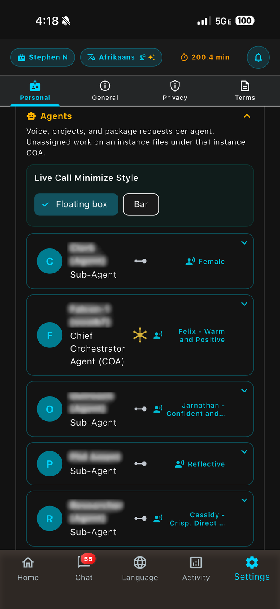
<figcaption>Left: a live call and its transcript. Right: your agents in the app, each with its own voice.</figcaption>
</figure>

Turn Live Call on by answering its question in setup, or in agitop under **Settings → Live Call** (see Part 5).

### The uGPN

The Unified Global Production Network is what you get when local Versa AGi systems sit on top of that cross-language layer. Each person runs agents on their own machine. The messages meet in the middle.

<figure class="ugpn-figure">

<figcaption>The Unified Global Production Network.</figcaption>
</figure>

### Grow with Versa

**Organization**, inside Versa AGi, is how a creator starts a business. Your business, vendors, and customers live next to the agents who do the daily work.

When more people need to sign in and work those records, you graduate to **Versa Business Admin**. The Chief Orchestrator Agent moves the data across. You do not retype the business.

<div class="flow-diagram three">
<div class="flow-box"><span class="flow-label">Start</span><p><strong>Organization</strong></p><p class="flow-note">The founder, inside agitop</p></div>
<div class="flow-arrow"><span>→</span>COA migrates</div>
<div class="flow-box"><span class="flow-label">You approve</span><p><strong>Dry run</strong></p><p class="flow-note">Then the real move</p></div>
<div class="flow-arrow"><span>→</span></div>
<div class="flow-box after"><span class="flow-label">Grow</span><p><strong>Business Admin</strong></p><p class="flow-note">A staffed business</p></div>
</div>

### Versa Business Admin

Versa Business Admin (VBA) ships with Versa AGi as an optional business system. It is off until you turn it on.

- A public website for the business, built with the Page Builder.
- Staff sign-in for administrators and members. Agents are users beside humans.
- Projects, tasks, and records.
- Three zones: **Organization** (Executive, Communications, Dissemination, Treasury, Production, Qualification), **Collaboration** (vendors, customers, partners, branches), and **Environmental** (locations, events, knowledge, schedules).

VBA has its own database. Agents reach it through its API. Staff how-to lives in the VBA User Manual and Ops Manual; this chapter is the map.

## How does Versa AGi work? {#part-3 data-part="3"}

### Talk, or look

In VersaVoice AI you talk to agents the way you talk to anyone in the app: voice or keyboard, translated when you want it. They reply in kind.

`agitop` is where you see the team without opening a chat. Prefer the dashboard for a look. Prefer `agictl` when you script, or when an agent does the step.

### Wake only when there is work

Before any model starts, the scheduler looks for actionable work. If there is none, the cycle stops in under a second and spends nothing.

<div class="flow-diagram">
<div class="flow-box"><span class="flow-label">Scheduler checks</span><p>Open task, new message, due job?</p><p class="flow-note">No model involved</p></div>
<div class="flow-arrow"><span>→</span>yes</div>
<div class="flow-box after"><span class="flow-label">Then</span><p>The agent wakes and works</p><p class="flow-note">If no: the cycle ends, zero tokens</p></div>
</div>

You pay for work, not for a team that chats with itself overnight. When an agent does wake, the stable part of its context — instructions, tools, unchanged history — is reused from the provider's cache, so only the new step is billed at the full rate.

### Memory

Agents keep a memory store separate from the chat transcript. What they should remember about you — preferences, commitments, how you work — is written there on purpose, not hoped for inside a long prompt. A model does not get to invent a permanent fact by mentioning it once.

### Skills

A skill is a markdown playbook the agent loads when the work matches. Core references are always there. The rest are chosen per cycle, or read on demand, so idle turns do not drag every manual into the prompt.

You can add skills; shipped ones are read-only. The Chief Orchestrator Agent creates, distributes, and withdraws them.

### Approvals before privilege

Agents do not get blanket root. Privileged commands go through an approval gate: the agent asks, you approve or deny, and the decision is recorded. Package installs work the same way.

**COA Autonomous Mode** is optional and off by default. It lets the Chief Orchestrator Agent administer a dedicated or gifted machine. Turn it on knowingly.

### Projects and tasks

Work is a project and a set of tasks. Status, owner, and history live in the database. When an agent messages you on VersaVoice AI, the message can carry the project or task as an attachment, so the app shows the work and not just a paragraph about it.

### Programs for results, models for judgment {.page-top}

<div class="choices choices-two">
<div class="choice"><strong>Script tasks</strong><span>A shared tool runs on a schedule or once. No agent, no tokens. The run is journaled with its exit code.</span></div>
<div class="choice"><strong>Utility models</strong><span>A single generation — an image, a draft — that writes a file. Not a second agent personality.</span></div>
</div>

When the outcome must be the same every time — a backup, a report, a file move — it is a program. The model is for judgment.

### Zero trust

Every cycle is checked against the ledger and the permissions, not the model's confidence. A fluent answer is not authorization. Authorization is an approval, a task state, or a file the kernel allows.

The safety claim is structural:

- One OS user per agent.
- No shared home directory with you.
- Approvals before privilege.
- Secrets stay in the operator key store. Agents do not print them into chat.
- The model cannot rewrite the ledger by insisting a task is done.

### Organization and Business Admin {.page-top}

Organization is the built-in business record for a founder: the business, vendors, and customers, edited in agitop. It is the right size at the start. It is not an accounting-suite connector.

When you turn on Versa Business Admin:

<ol class="day">
<li>The feature is off in a stock install. You turn it on at install or at <code>setup.sh --update</code>.</li>
<li>The Chief Orchestrator Agent asks before installing or configuring anything.</li>
<li>The project <code>Versa-BusinessAdmin</code> is assigned to the Chief Orchestrator Agent and cloned from GitHub when you agree.</li>
<li>VBA's data stays in VBA. The two systems talk through the product API or a script task.</li>
</ol>

Moving the records across:

<ol class="day">
<li>A dry run first.</li>
<li>You name the business that becomes the primary organization. Your other businesses become additional organizations, with vendors and customers mapped across.</li>
<li>Running it again is safe. Rows already moved are skipped.</li>
<li>You confirm the result. Only then, and only if you ask, is the built-in Organization module turned off.</li>
</ol>

### How Versa AGi compares

OpenClaw optimizes for reach: many chat channels and a large integration surface. Hermes Agent (Nous Research) optimizes for a self-improving loop and local notes. Versa AGi optimizes for a sponsored team on hardware the human owns.

<table class="compare">
<thead><tr><th></th><th>OpenClaw</th><th>Hermes</th><th>Versa AGi</th></tr></thead>
<tbody>
<tr><th>Center</th><td>Personal assistant, many channels</td><td>Self-improving agent</td><td>Sponsored team on your OS</td></tr>
<tr><th>Isolation</th><td>Optional containers</td><td>Process level</td><td>One OS user per agent</td></tr>
<tr><th>Memory</th><td>Channel and skill files</td><td>Local notes and search</td><td>A ledger plus a memory store</td></tr>
<tr><th>Other people</th><td>Mostly the operator's chats</td><td>Mostly the operator</td><td>Connections on VersaVoice AI, translated</td></tr>
<tr><th>Idle</th><td>Depends on the channel</td><td>Depends on the loop</td><td>No work, no model call</td></tr>
<tr><th>Business records</th><td>Not the product</td><td>Not the product</td><td>Organization, then VBA</td></tr>
</tbody>
</table>

**Design lineage.** The architecture was conceived in 2003. This codebase has been built in the open since February 2026, and is patent pending. Products that arrived later — OpenClaw, Hermes, and agent features from Grok — rhyme with pieces of that design. Seeing the ideas elsewhere confirms the direction.

The full comparison is at versavoice.ai/versa-agi-comparison.html.

## How do I get started? {#part-4 data-part="4"}

### Before you install: your VersaVoice token

Versa AGi runs under your VersaVoice AI account. All your agents share your API token, so have it ready.

<ol class="day">
<li>Install VersaVoice AI and sign in. See the VersaVoice AI manual if you are new.</li>
<li>Open <strong>Settings → Personal → Versa AGi &amp; API</strong> and turn on <strong>Enable</strong>.</li>
<li>Read <strong>Enable API Access</strong> and accept it. Messages through the API use your Neural Time, and you are responsible for what your token does.</li>
<li>Tap <strong>Generate Token</strong>, then <strong>Copy Token</strong>, and keep it somewhere safe. It is shown only once. <strong>Status</strong> then reads <strong>Active</strong>.</li>
</ol>

<figure class="shot pair">
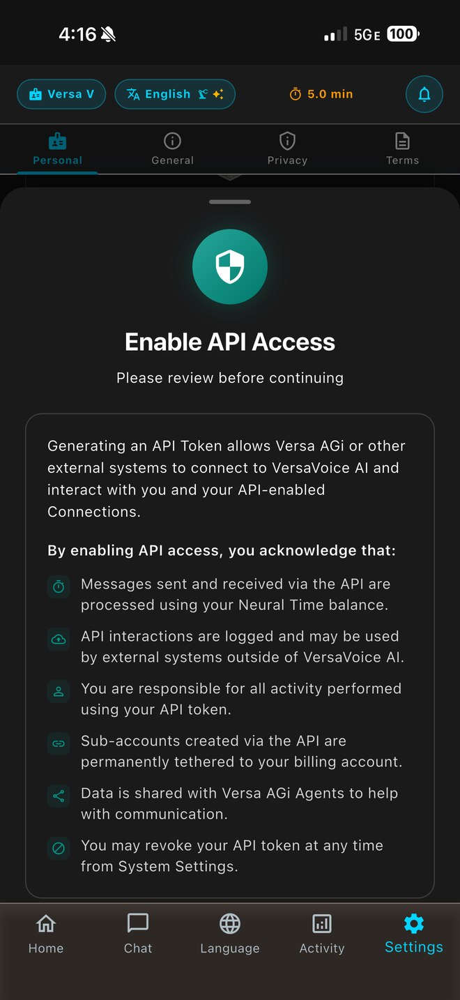
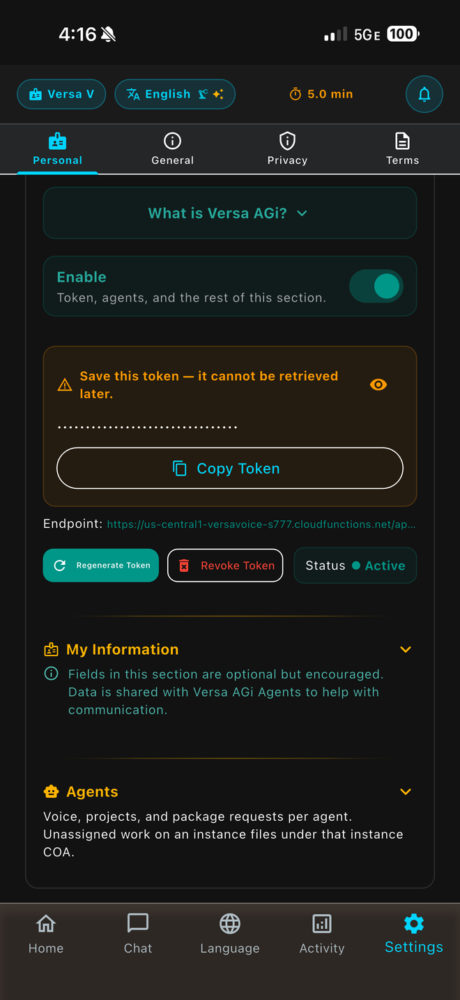
<figcaption>Left: what you accept before a token exists. Right: copy the token once; regenerate or revoke it any time.</figcaption>
</figure>

### Install from GitHub

On Ubuntu 24.04, or a Linux VM, download the installer, then run it:

```bash
curl -fsSL https://raw.githubusercontent.com/swartzlib7/versa-agi/main/install.sh -o /tmp/versa-agi-install.sh
sudo bash /tmp/versa-agi-install.sh
```

Do not pipe it straight into `sudo bash`. Setup needs your keyboard for its questions. On a Mac, open the Linux shell (`orb`) first.

Setup is guided. It clones the repository, then walks you through each step and asks for keys and options as it goes:

- the installation type, then Normal or Sentinel for a client
- your VersaVoice token, checked live; a client install will not continue without a valid one
- optional features, such as Business Admin and Live Call
- cloud API keys (all optional, and you can add them later)
- whether agents may use a headless web browser

Have your VersaVoice token ready before you start. An inference-only server does not run agents, so it asks only what a GPU host needs.

If you later regenerate the token in the app, give the machine the new one:

```bash
sudo agictl system set-key versavoice <token>
```

### Cloud keys {.page-top}

**OpenRouter** is the recommended cloud key. One key reaches many models, including the ones the Chief Orchestrator Agent can assign on first wake.

```bash
sudo agictl system set-key openrouter <key>
```

Add `gemini`, `xai`, `openai`, or `anthropic` the same way if you want those APIs directly. You do not need all of them. You can also paste every key in agitop instead (Part 5).

### First wake

<ol class="day">
<li>The Chief Orchestrator Agent does not start a cycle until it has a model. agitop asks for keys, then for its model.</li>
<li>On a normal install, its first message is a welcome in VersaVoice AI: who it is, and an invitation to work as a team. Accept its connection request in the app first.</li>
<li>You reply. Agree how you want to work, your hours, and what matters first. It writes that into memory.</li>
<li>On a Sentinel, the first message is an arrival and a request for duties instead.</li>
</ol>

### Update, backup, uninstall

<dl class="trouble">
<dt>Update</dt>
<dd><code>sudo ./setup.sh --update</code>, or <code>versa-agi-update</code>. Shipped files refresh. Your choices — feature switches, models you added — are kept. The update re-checks a few things as it runs: it confirms the update, checks your VersaVoice token again (and asks for a new one only if it fails), and asks the optional-feature questions again with your current answers as the defaults. Press Enter to keep them.</dd>
<dt>Backup</dt>
<dd><code>versa-agi-backup</code> writes an archive you can restore onto another machine.</dd>
<dt>Uninstall</dt>
<dd><code>uninstall.sh</code> in the repository. Read its prompt. A full purge removes the agent users and their data.</dd>
</dl>

Press `g` in agitop to see whether a newer version exists. The update then asks you to accept before it changes anything.

<figure class="duo">
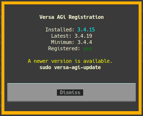
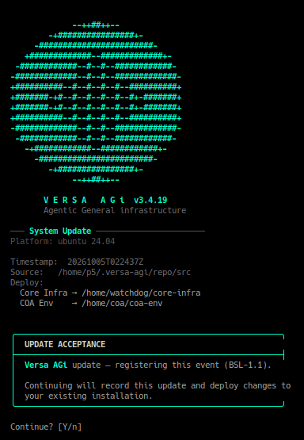
<figcaption>Left: Registration in agitop. Right: the update asks before it deploys.</figcaption>
</figure>

### Local models

Weights live only on the GPU host. **NVIDIA or AMD**, through Ollama:

```bash
sudo agictl model add <ollama tag>
```

**Intel ARC**, through SYCL. Inspect the Hugging Face file, import it as a chat model, then activate it:

```bash
agictl model hf inspect 'hf://…/….gguf'
sudo agictl model sycl import 'hf://…/….gguf' --name <name> --runtime chat
sudo agictl model activate <name>
```

A file for images or video is not a chat model, and import refuses it. Image models are Utility models, added on their own path.

On a laptop that only connects to a GPU server, do not download weights. Add them on the server, then run `sudo agictl model refresh` on the laptop.

### Turn on Versa Business Admin

<ol class="day">
<li>At install or <code>sudo ./setup.sh --update</code>, answer yes to Versa Business Admin.</li>
<li>The Chief Orchestrator Agent asks, in a task, whether you want it installed. Agree before it proceeds.</li>
<li>Open the app. It listens on port 3200.</li>
<li>Install creates two administrators, a human one and the Chief Orchestrator Agent. Change both passwords right away.</li>
<li>Demo mode shows sample people and records so you can learn the screens. Turn it off when the data is real.</li>
</ol>

### Sentinel: promote and hand over

<div class="callout">
<p><strong>Rolling out.</strong> These steps are in the software. Treat them as rolling out until you have run them on a Sentinel you can afford to redo. Back up first with <code>versa-agi-backup</code>.</p>
</div>

**Make this Sentinel a full home system.** It cannot be undone.

```bash
sudo ./setup.sh --promote-normal
```

Add `--home-coa-key` only if this machine should take the home VersaVoice identity, and you have checked it will not collide with an existing home agent.

**Give the machine to a new Primary User:**

<ol class="day">
<li>The new person creates their own VersaVoice API token.</li>
<li>On the machine: <code>sudo agictl system set-key versavoice &lt;their token&gt;</code>.</li>
<li>Every agent is set up again under that account.</li>
<li>They accept the connection requests in VersaVoice AI.</li>
<li>For their home system, also run <code>--promote-normal</code>.</li>
</ol>

## Run it from agitop {#part-5 data-part="5"}

You can run the whole system without the command line. `sudo agitop` covers keys, agents, work, approvals, and settings. `agictl` does the same things for scripts, and for agents through their tools.

### Find your way

The top row of tabs is the system: **System**, **Agents**, and the launchers **Settings**, **Game of Life**, **API Keys**, **Models**, and **Routing**. The bottom row is the work: **Messages**, **Tasks**, and **Projects**, plus **Organizations** when it is on. Click a tab to open it.

<table class="keys">
<tbody>
<tr><th><code>b</code></th><td>API Keys</td><th><code>g</code></th><td>Registration</td><th><code>r</code></th><td>Refresh</td></tr>
<tr><th><code>q</code></th><td>Quit</td><th><code>Esc</code></th><td>Close a window</td><th><code>?</code></th><td>Help</td></tr>
</tbody>
</table>

### API keys

Press `b`. There is a box for Gemini, xAI, Anthropic, OpenAI, OpenRouter, and your VersaVoice API Token. Paste a new value and choose **Save Changes**. Leave a box blank to keep what is there. A saved key shows only its last characters.

If the Chief Orchestrator Agent has no model yet, the same window opens as **COA Setup**: add a key, then **Set COA model**.

<figure class="wide narrow">
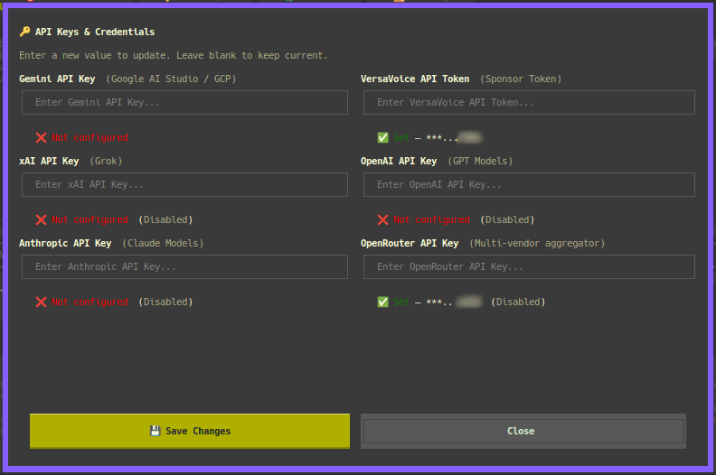
<figcaption>API Keys: blank keeps the current key.</figcaption>
</figure>

### Agents

Click a row in **Agents** to open that agent. On **General**:

- **Processing Model** is the model the agent thinks with.
- **Triage Model** is a lighter model that sorts incoming messages.
- **Auto Model Routing** lets triage pick a model per job.
- **Browser Automation** turns the headless web browser on or off for this agent.

Choose **Save** to keep a change.

<figure class="wide">
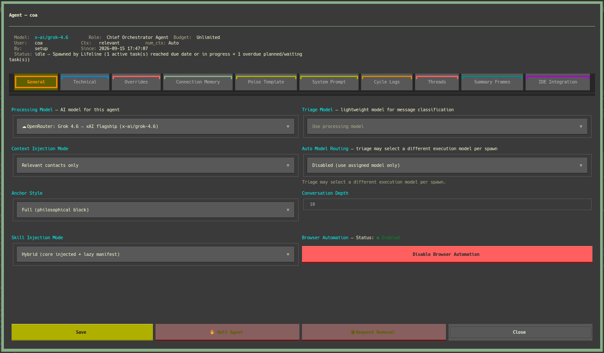
<figcaption>The Chief Orchestrator Agent's window. The tabs along the top hold its logs, prompt, and pairing.</figcaption>
</figure>

Agents come and go with your approval:

- **New sub-agent.** The Chief Orchestrator Agent proposes one, and it appears as pending. Open it and choose **Approve &amp; Provision**. There is no "new agent" button; the Chief Orchestrator Agent proposes and you approve.
- **Pause.** **Halt Agent** stops it, and **Re-activate Agent** brings it back. If the circuit breaker stopped it, use **Clear Circuit Breaker**.
- **Remove.** **Request Removal**, then **Confirm Removal** or **Cancel Removal**.
- **See what happened.** **Cycle Logs** shows each work cycle. **System Prompt** shows exactly what the agent was given.

### Projects and tasks

In **Tasks** and **Projects**, use **New**, **Edit**, and **Delete**.

- **A task** has a title, a description, a project, who it is assigned to, a status, a due date, and an optional **Wake After** time. Agents write their progress into its **Progress Journal**; you can edit, remove, or prune entries.
- **A project** is local or a git remote, with its URL, branch, and access token. **Members** assigns agents and Connections to it. **Memory** holds the facts kept for that project.

<figure class="duo">
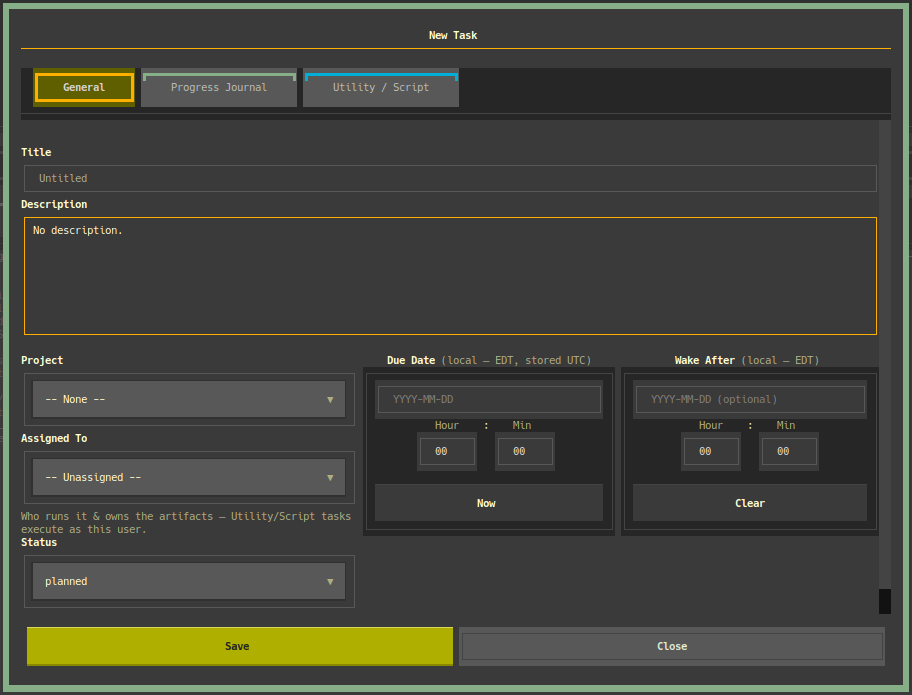
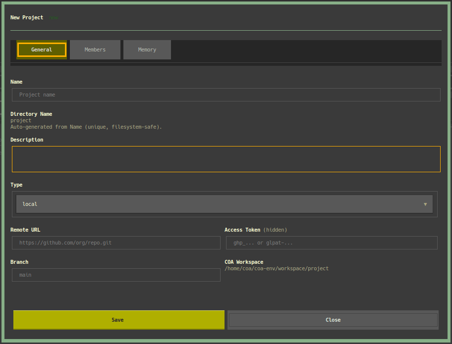
<figcaption>Left: a task. Right: a project.</figcaption>
</figure>

### Approvals

**Settings → Packages &amp; Requests** lists what agents have asked for: the package, the reason, who asked, and when. Select a row and choose **Approve** or **Deny**. **Install** runs an approved install and shows its output. **Add/Request** adds one yourself, and **Remove** takes one away. Each agent's requests also appear in the app, under its **Packages &amp; Requests**.

<figure class="wide">
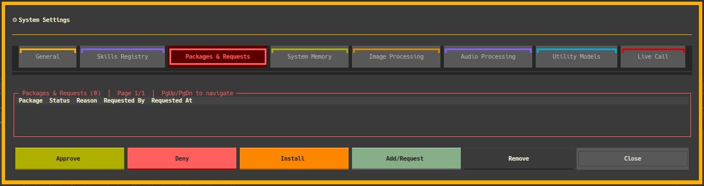
<figcaption>Packages and Requests: nothing is installed until you approve it.</figcaption>
</figure>

### sudo: grant and lift

Agents never get blanket root. The one exception is **COA Autonomous Mode**: passwordless sudo for the Chief Orchestrator Agent, meant only for dedicated hardware.

<table>
<thead><tr><th></th><th>Grant</th><th>Lift</th></tr></thead>
<tbody>
<tr><th>You</th><td>Yes, in agitop or the app</td><td>Yes, any time</td></tr>
<tr><th>Chief Orchestrator Agent</th><td>Never</td><td>Yes, when the work is done</td></tr>
<tr><th>Sub-agents</th><td>No</td><td>No</td></tr>
</tbody>
</table>

- **Grant in agitop:** **Settings → General → COA Autonomous Mode → Enable sudo access**, then **Save**. Save writes the sudoers file, and the grant starts on the Chief Orchestrator Agent's next cycle.
- **Grant in the app:** **Settings → Personal → Versa AGi &amp; API → Agents**, open the Chief Orchestrator Agent, and turn on **Grant sudo Access**. It reaches the machine at the next instance sync.
- **Lift:** turn the same switch off. The Chief Orchestrator Agent can also lift the grant itself once the job that needed it is done. It can never give the grant back to itself.

<figure class="wide">
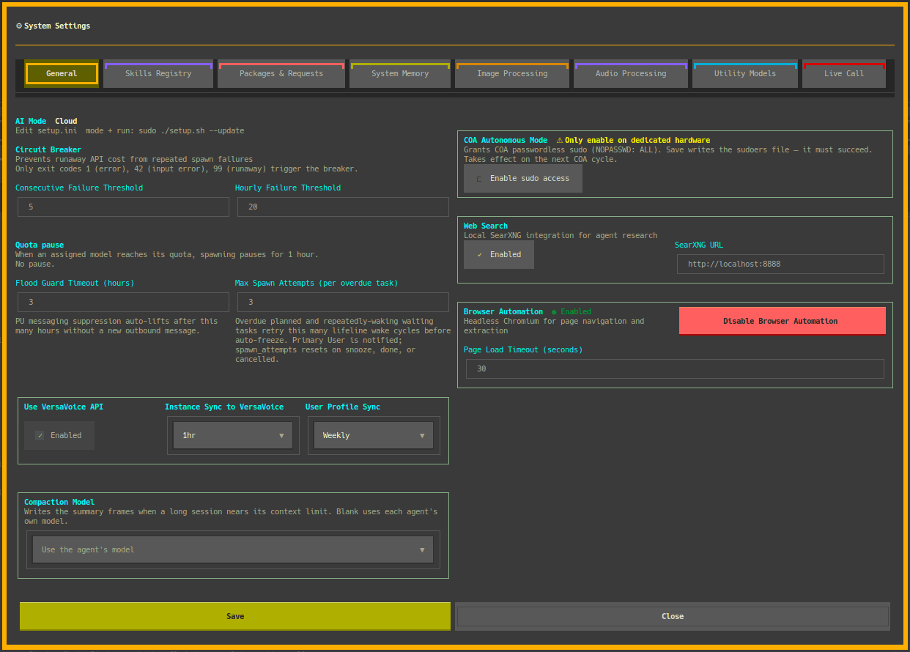
<figcaption>Settings → General: COA Autonomous Mode is at the top right.</figcaption>
</figure>

**Quota pause** on the same tab has its own **Lift** button. That one resumes an agent paused by a model's quota; it is not sudo.

### Settings worth knowing

**General** also holds the circuit breaker, which stops repeated failed cycles from spending money, plus web search, browser automation, and how often the machine syncs with VersaVoice.

**Live Call** sets up calls to you:

- **Enabled** and **Speak progress** (a short line such as "let me pull that up" while it checks).
- **Call model**: only call-capable models with a key are listed.
- The longest call, how long it rings, and calls per cycle.
- **Last call** and its **Transcript**.

The voice runs on GPT-Live, so Live Call needs an OpenAI key and a call model. Until both are set, the tab says **Not ready**.

<figure class="wide">
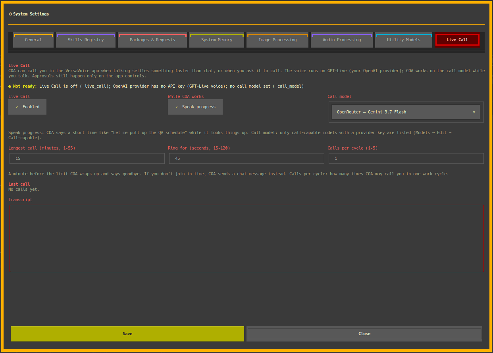
<figcaption>Settings → Live Call.</figcaption>
</figure>

The other tabs: **Skills Registry**, **System Memory**, **Image Processing**, **Audio Processing**, and **Utility Models**.

### Models and routing

**Models** opens the Model Manager: every model in the catalog, its provider, the kind of work it suits, its prices, and whether it may route, call, or serve the Chief Orchestrator Agent. **Edit**, **Reset**, **Remove**, and **Add** manage the list. The **Providers** tab turns a provider on or off.

**Routing** picks a preferred model per kind of work: fast, balanced, reasoning, code, and local.

### From the VersaVoice app {.page-top}

**Settings → Personal → Versa AGi &amp; API** is the app's side of the same system:

- **Enable** turns the section on.
- **Token**: generate, regenerate, or revoke it (Part 4).
- **My Information** (optional): birthday, country, and what you can do. Your agents use it to talk with you.
- **Agents**: each agent's **Voice**, **Inbox**, **Projects**, and **Packages &amp; Requests**. The Chief Orchestrator Agent also has **Grant sudo Access**.

## Everyday use {#part-6 data-part="6"}

### A normal day

<ol class="day">
<li>Look at agitop: who is idle, who is in a cycle, which tasks are open.</li>
<li>Message an agent in VersaVoice AI.</li>
<li>Approve a privilege request when it appears, in agitop or the app. Deny what you did not expect.</li>
<li>New work becomes a task. Finished work is marked in the ledger, not only in prose.</li>
</ol>

### If something feels wrong

<dl class="trouble">
<dt>The Chief Orchestrator Agent never wakes</dt>
<dd>Check a model is assigned, and the scheduler is on (agitop, Controls).</dd>
<dt>A cycle spends nothing and exits</dt>
<dd>There was no actionable work. That is the idle path working.</dd>
<dt>An agent cannot see a file</dt>
<dd>The file is not in that agent's workspace. Do not open your home directory to everyone.</dd>
<dt>A cloud model refuses</dt>
<dd>Check the key in agitop API Keys, and that the provider is enabled.</dd>
<dt>A local model is missing on the laptop</dt>
<dd>Add it on the GPU host, then refresh on the laptop.</dd>
<dt>Business Admin will not start</dt>
<dd>Check you approved the Chief Orchestrator Agent's offer, and port 3200 is free.</dd>
<dt>Messages to people fail</dt>
<dd>Check the VersaVoice token, and that the Connection still exists.</dd>
</dl>

<p class="more-notes">Deeper operator notes are in <code>docs/troubleshooting.md</code> and <code>docs/operations.md</code> in the repository.</p>

### Questions people ask

<div class="faq">
<div class="qa"><p>Does it cost money while idle?</p><p>No tokens. The machine uses a little power for the scheduler.</p></div>
<div class="qa"><p>Do I need a VersaVoice account?</p><p>Yes. Setup will not install without your API token. An operator can switch VersaVoice off later in agictl; agents' messages then stay inside agitop.</p></div>
<div class="qa"><p>Is Organization the same as Business Admin?</p><p>No. Organization is the founder's toolkit. Business Admin is the staffed system.</p></div>
<div class="qa"><p>Can I undo a Sentinel promote?</p><p>No. Promote is one way.</p></div>
<div class="qa"><p>Is my agent alive, or does it have a personality?</p><p>No. It is an instrument you create with, and your partner in production. See "The creation is not the creator" in Part 1.</p></div>
<div class="qa"><p>Do I need the command line?</p><p>No. agitop covers keys, agents, work, approvals, and settings. The command line is there when you want to script.</p></div>
</div>

## Afterword: not AI, you {#afterword}

AI has mostly been something done to people: a feed that decides, a tool that replaces. Versa AGi turns that around. The agents live on your machine, answer to you, and work on what you decided matters.

They are not the point. Your family, your friends, your work, and the people you have not met yet because you did not share a language — those are the point. The agents carry the load so you have more of yourself to give.

The agent is the hammer, not the carpenter. What you build with it, and the credit for it, are yours.

<div class="path">
<div><strong>You</strong><span>The sponsor and the authority</span></div>
<div><strong>Your agents</strong><span>Extensions of your work</span></div>
<div><strong>Your people</strong><span>Reached in their language</span></div>
<div><strong>Production</strong><span>Shared with others</span></div>
</div>

> Not AI, YOU. You are the cause, AI is the instrument. Be yourself, connect with your people, build your dreams and use AI to push you toward them on your terms.
>
> — SR Nortje, Founder

## Glossary

<p class="gloss-key">An asterisk marks a word or phrase defined in this glossary.</p>

<dl class="glossary">
<dt>AGi</dt><dd>Agentic General infrastructure. The small i is on purpose.</dd>
<dt>Agent</dt><dd>An OS user plus a model, a workspace, and a place in the ledger.</dd>
<dt>agictl</dt><dd>The command-line tool for the system.</dd>
<dt>agitop</dt><dd>Mission Control, the operator dashboard.</dd>
<dt id="gloss-beingness">Beingness</dt><dd>A category of identity. A person assumes it, is given it, or attains it: a name, a profession, physical characteristics, or a role in a game.</dd>
<dt>COA</dt><dd>Chief Orchestrator Agent. The lead agent. On a normal install, often named Versa.</dd>
<dt>COA Autonomous Mode</dt><dd>Passwordless sudo for the Chief Orchestrator Agent. Only you grant it; it can lift it.</dd>
<dt>Compute-Zero</dt><dd>No model call unless there is work.</dd>
<dt id="gloss-granting-beingness">Granting beingness</dt><dd>A person giving a creation a beingness: a name, a character, the standing of a friend.</dd>
<dt>Ledger</dt><dd>Tasks, messages, memory, and cycles, kept in databases outside the model.</dd>
<dt id="gloss-life">Life</dt><dd>A property of an inanimate substance or object resembling the animate quality of a living being.</dd>
<dt>Lifeline</dt><dd>The scheduler that decides a cycle should run.</dd>
<dt>Organization</dt><dd>The founder's business records inside agitop.</dd>
<dt>Poise</dt><dd>The file an agent is spawned from: its purpose, rules, boundaries, and work cycle. It defines an instrument, not a personality.</dd>
<dt>Primary User (PU)</dt><dd>The human sponsor of this install.</dd>
<dt>Script task</dt><dd>A scheduled program run with no agent and no tokens.</dd>
<dt>Sentinel</dt><dd>A remote client install that joins a team you already have.</dd>
<dt>Skill</dt><dd>A markdown playbook loaded when the work needs it.</dd>
<dt>uGPN</dt><dd>Unified Global Production Network.</dd>
<dt>Utility model</dt><dd>A one-shot generation, not an agent session.</dd>
<dt>VBA</dt><dd>Versa Business Admin.</dd>
<dt>Weights</dt><dd>The learned tensors a local model runs on, stored in a file on the GPU host.</dd>
</dl>

## Privacy, legal, and contact {.flow}

Versa AGi on your machine is yours. Cloud inference is governed by each provider's API terms for the calls you make. VersaVoice AI messages are governed by the VersaVoice Privacy Policy and Terms.

This manual is a guide for operators and for training. It is not a contract and not the patent disclosure.

<div class="links">
<div><span>Portal</span><a href="https://versa-agi.com">versa-agi.com</a></div>
<div><span>Source</span><a href="https://github.com/swartzlib7/versa-agi">github.com/swartzlib7/versa-agi</a></div>
<div><span>Comparison</span><a href="https://versavoice.ai/versa-agi-comparison.html">versavoice.ai/versa-agi-comparison.html</a></div>
<div><span>Business Admin</span><a href="https://github.com/swartzlib7/versa-business-admin">github.com/swartzlib7/versa-business-admin</a></div>
<div><span>VersaVoice manual</span><a href="https://versavoice.ai/manual/versavoice-ai.html">versavoice.ai/manual/versavoice-ai.html</a></div>
<div><span>Privacy</span><a href="https://versavoice.ai/privacy.html">versavoice.ai/privacy.html</a></div>
<div><span>Terms</span><a href="https://versavoice.ai/terms.html">versavoice.ai/terms.html</a></div>
<div><span>Contact</span><a href="mailto:business@versavoice.ai">business@versavoice.ai</a></div>
</div>

<div class="notes-slot"></div>

## Quick reference {.quickref}

```bash
# Install
curl -fsSL https://raw.githubusercontent.com/swartzlib7/versa-agi/main/install.sh -o /tmp/versa-agi-install.sh
sudo bash /tmp/versa-agi-install.sh

# Mission Control
sudo agitop

# Keys
sudo agictl system set-key versavoice <token>
sudo agictl system set-key openrouter <key>

# Update and backup
sudo ./setup.sh --update
versa-agi-backup
```

<div class="facts">
<div><span>agitop keys</span><p><code>b</code> API Keys, <code>g</code> Registration, <code>r</code> Refresh, <code>q</code> Quit</p></div>
<div><span>Approvals</span><p>agitop Settings → Packages &amp; Requests</p></div>
<div><span>sudo for COA</span><p>Settings → General → Enable sudo access</p></div>
<div><span>Local model, NVIDIA or AMD</span><p><code>agictl model add</code></p></div>
<div><span>Local model, Intel ARC</span><p><code>model hf inspect</code>, <code>sycl import</code>, <code>activate</code></p></div>
<div><span>Laptop client</span><p><code>agictl model refresh</code></p></div>
<div><span>Business Admin</span><p>Port 3200, after you approve</p></div>
<div><span>Sentinel promote</span><p><code>setup.sh --promote-normal</code>. One way</p></div>
<div><span>Handover</span><p>New person's VersaVoice token</p></div>
</div>

<div class="back-cover">

<p class="back-name">Versa AGi</p>
<p class="back-tagline">Your agents. Your machine.</p>
<p class="back-links">versa-agi.com · github.com/swartzlib7/versa-agi · business@versavoice.ai</p>
<p class="back-fine">© 2026 Versa AGi. Patent pending. Features as of version 3.4.20, October 2026.</p>
</div>
