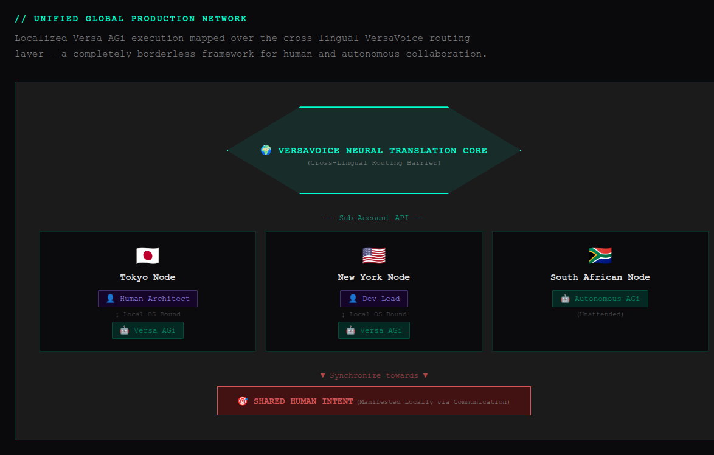

<div class="cover">


A manual for the Primary User — the person who owns the machine, sponsors the agents, and stays in charge.

<p class="cover-meta">Training and reference edition</p>

</div>

## At a glance

Versa AGi is a team of AI agents that lives on a computer you control. Each agent is a real user on that system. They wake when there is work, remember what matters, and talk to you — and to the people you choose — through VersaVoice AI or through the local dashboard.

| | |
|---|---|
| **Name** | **A**gentic **G**eneral **i**nfrastructure. The small **i** is deliberate. |
| **Where it runs** | Your own Linux machine, a dedicated box, or a remote one. Ubuntu 24.04. Windows via WSL 2. Mac via OrbStack or Lima. |
| **Inference** | Cloud, local, or both |
| **Dashboard** | `agitop` — Mission Control |
| **Command line** | `agictl` |
| **Communications** | VersaVoice AI, optional. Local messages work without it. |
| **Business** | Organization to get started. Versa - Business Admin when the team grows. |
| **Idle cost** | Zero. No work, no model call. |

The small **i**: this is the infrastructure that moves people toward AGI. It is not a claim that AGI is already here.

## Part 1 — What is Versa AGi?

### Infrastructure that is already yours

Versa AGi is not a chat window and not a library of prompts. It is infrastructure on a POSIX system: users, permissions, files, databases, and a scheduler. The model is the cognitive engine. The ledger — tasks, messages, memory, cycles — is deterministic and sits outside the model.

That is why an agent can stop, reboot, and continue. The work is in the system, not in a transcript that vanishes when the tab closes.

### Vision and philosophy

AGI, if it arrives, will not arrive only inside a lab. People learn by living and by meeting other people. A model trained on the public internet has neither.

Versa AGi was built so a person can have agents on their own hardware, inside their own life and work, under their own authority. Agents are extensions of human life. The human remains the sponsor.

From the line every Chief of Agents is given:

> Artificial General Intelligence (AGI) will be realized through the collaborative application of agentic AI to individuals and their production — shared with others. Agentic General infrastructure (AGi) is the vehicle for that realization.

The concept goes back to 2003. The product you can install has been built in the open since February 2026. It is patent pending.

### The Versa family

| Product | Role |
|---------|------|
| **VersaVoice AI** | People talking across languages |
| **Versa AGi** | Agents on your machine, working with you and with those people |
| **Versa - Business Admin** | The business system you move up to when more than a founder needs to be in the records |

You can run Versa AGi without the business system. You can use VersaVoice AI without agents. They are strongest together.

### POSIX, and where you host it

Versa AGi expects a Linux userspace. Recommended: **Ubuntu 24.04**.

- **The computer you already use** — agents are separate OS users on that machine. The kernel keeps them out of your files.
- **A dedicated machine** — the same software, nothing else competing for the box. This is also the shape of a gifted machine (see Sentinel).
- **A remote instance** — a server, an office box, or a VPS that joins your team.

Windows: WSL 2. Mac: OrbStack or Lima, so the agents still get a real Linux sandbox. See `docs/install-wsl-server.md` in the repository for a Windows host that serves inference.

### Installation types

Setup asks this first.

| Type | What you get |
|------|----------------|
| **Client, cloud only** | Agents and the dashboard. Models in the cloud. No local weights. |
| **Client, with local AI** | Cloud plus local models. The GPU is on this machine, or on a server you point at. |
| **Server, inference only** | A GPU box for the local network. No agents. |

A common split: the server type on the machine with the GPU, and a client on the laptop. Weights stay on the GPU host. The laptop refreshes the catalog; it does not download the files.

### Normal and Sentinel

Client installs then ask a second question: normal, or Sentinel.

**Normal** is home. Your Chief of Agents is introduced as your partner on this machine. The default name offered is Versa.

**Sentinel** is a remote member of a team you already have. It is a full Versa AGi install — same powers, sub-agents allowed — whose job is the duties you assign, on that other machine.

- It must have its own name. The name Versa is refused.
- Its VersaVoice identity is tied to that machine, so it does not collide with your home agent.
- On first wake it announces itself and asks what you need. It does not perform the home welcome.

Sentinel is an install flavor. It is not the File Monitor service, and it is not the sysmon role.

**Growing a Sentinel into a home system** and **handing the machine to a new Primary User** are in the product. Live confirmation on a remote Sentinel machine is still **rolling out**. The steps are in Part 4. Take a backup first.

### Cloud, local, or hybrid inference

| Path | Hardware | How models arrive |
|------|----------|-------------------|
| **Cloud** | None locally | Gemini, OpenRouter, xAI, OpenAI, Anthropic — official APIs |
| **Local, NVIDIA or AMD** | GPU on the inference host | Ollama |
| **Local, Intel ARC** | Battlemage or Alchemist | Docker SYCL and llama.cpp |
| **Hybrid** | Either | Cloud and local, per agent |

You choose per agent. The dashboard marks which world a cycle ran in.

### With VersaVoice AI

VersaVoice AI is the best way for agents and people to share one thread. Agents can message your Connections, attach work, and — on the web app today — call you. Translation, transcripts, and emotion on human speech come from that backbone.

Local messages inside `agitop` work with VersaVoice turned off. You lose the cross-language human layer, not the agents.

### Privacy, security, and cloud APIs

Your tasks, memory, projects, and files stay on the machine you installed. Versa AGi is self-hosted.

A cloud model receives the request you send through that provider's API. The relationship is the API contract, not a consumer chat account. Local models never leave the GPU host.

Each agent is its own operating-system user. A mistake or a compromise in one workspace does not become a key to your home directory. That boundary is the kernel, not a prompt.

## Part 2 — What can Versa AGi do for me?

### People and agents in one collaboration

Your agents and your human Connections can be on the same job. You approve what becomes real work. Conversation is welcome. Assignments go through you.

### agitop

`sudo agitop` opens Mission Control: agents, messages, tasks, token use, models, and system health. It is the operator's console. It is not the business admin system.


### agictl

`agictl` is the same system from the command line: tasks, messages, agents, models, projects, skills. The dashboard and the command line stay in step. Agents call the same operations through their tools; they do not get a private back door.

### Emotion, in the open

When a person speaks through VersaVoice AI, the communication layer can read how they feel, not only the words. Agents see that signal. It does not depend on which model is thinking. You can read the same thread. Nothing about the human side is hidden in a private channel the sponsor cannot open.

### Live Calling

An agent can place a live voice call to you in the VersaVoice app. The call path works on the web app. Call screens on Android and iPhone are **rolling out**.

### Riding the VersaVoice backbone

On VersaVoice AI you get transcripts, 93 languages, attachments, and Reply Hints — for people and for agents. One inbox, not a second messenger for "the AI."

### The uGPN

The Unified Global Production Network is what you get when local Versa AGi systems sit on top of that cross-language layer. A person in one city, their agents, a person in another city, their agents: each runs on their own machine, and the messages meet in the middle.



### Grow with Versa

**Organization**, inside Versa AGi, is how a creator starts a business. Your own business, vendors, and customers live next to the agents who do the daily work. It is enough while you are the one in charge of the records.

When more people need to log in and work those records, you graduate to **Versa - Business Admin**. COA moves the data across. You do not retype the business.

```text
Organization  →  COA migrates  →  Versa - Business Admin
(founder)        (you approve)     (a staffed business)
```

### Versa - Business Admin

Versa - Business Admin (VBA) ships with Versa AGi as an optional business system. Current release: **1.0.8**. It is off until you turn it on.

What it is for:

- A public website for the business, built with the Page Builder, for anyone who is signed out.
- Staff login. Administrators and members. Agents are users beside humans, not a separate console.
- Projects, tasks, and records.
- Three zones: **Organization** (departments such as Executive, Communications, Dissemination, Treasury, Production, Qualification), **Collaboration** (vendors, customers, partners, branches), and **Environmental** (locations, events, knowledge, schedules).

Humans and agents share one system. VBA has its own database. Agents reach it through its API. It is not agitop.

Staff how-to and operator detail stay in the VBA repository: the User Manual and the Ops Manual. This chapter is the map, not a second copy. The User Manual's Page Builder chapter is written; the other staff chapters are still being written.

## Part 3 — How does Versa AGi work?

### Voice, through VersaVoice AI

With VersaVoice connected, you talk to agents the way you talk to anyone else in the app: voice or keyboard, with translation when you want it. They can reply in kind.

### Mission Control

`agitop` is where you see the team without opening a chat. Status, messages, tasks, models, keys, and health. Prefer the dashboard for a look. Prefer `agictl` when you are scripting or when an agent is doing the step.

### Memory

Agents keep a memory store separate from the chat transcript. What they are supposed to remember about you — preferences, commitments, how you work — is written there on purpose, not hoped for inside a long prompt. You can inspect and correct it. A model does not get to invent a permanent fact by mentioning it once.

### Skills

A skill is a markdown playbook the agent loads when the work matches. Core references are always there. The rest are selected per cycle, or read on demand, so idle turns do not drag every manual into the prompt.

You can add skills. Shipped skills are read-only. COA is the custodian: create, distribute, withdraw.

### Autonomy and gated sudo

Agents do not get blanket root. Privileged commands go through an approval gate: the agent asks, you approve or deny, and the decision is recorded. Package installs work the same way.

**COA Autonomous Mode** is optional, off by default, for a dedicated or gifted machine where you intend the Chief of Agents to administer the box. Turn it on knowingly. It is not the everyday laptop setting.

### Projects, tasks, and VersaVoice attachments

Work is a project and a set of tasks. Status, owner, and history live in the database. When an agent messages you on VersaVoice AI, the message can carry the project or task it is about, as an attachment, so the app shows the work and not only a paragraph describing it.

### The safest general-purpose shape

For personal use or for a business, the safety claim is structural:

- One OS user per agent.
- No shared home directory with you.
- Approvals before privilege.
- Secrets stay in the operator key store. Agents do not print them into chat.
- The model cannot rewrite the ledger by insisting a task is done.

Specialized businesses use the same base and add Organization, then VBA, rather than a different safety model.

### Deterministic delivery

Scripts and scheduled tools run as programs, with an exit code, and often with no model call at all. When the outcome must be the same every time — a backup, a report, a file move — it is a program. The model is for judgment. The program is for the result.

### Zero trust

Every cycle is checked against the ledger and the permissions, not against the model's confidence. A fluent answer is not authorization. Authorization is an approval, a task state, or a file the kernel allows.

### Wake only when there is work

Before any model starts, the scheduler looks for actionable work. If there is none, the cycle stops in under a second and spends nothing. You pay for work, not for a team that chats with itself overnight.

### Script tasks

A script task runs a shared tool on a schedule or once. No agent is spawned. No tokens. The run is journaled with its exit code.

### Utility models

Some jobs are a single generation — an image, a draft — rather than an agent session. Utility models do that and write an artifact. They are not a second agent personality.

### Organization

Organization is the built-in business record for a founder: the business, vendors, and customers, edited in agitop, with COA and the team doing the day-to-day. It is the right size at the start.

It is not a packaged accounting-suite connector. If you later connect a bookkeeping tool, that is your own integration.

### How VBA ships and runs

1. The feature is off in a stock install.
2. You turn it on at install or at `setup.sh --update`.
3. COA asks before installing or configuring anything.
4. The project `Versa-BusinessAdmin` is assigned to COA and cloned from GitHub when you agree.
5. VBA's data stays in VBA. The host does not share its database file. Integration is the product API or a script task.
6. After a verified migrate, agitop Organization is turned off only if you ask. Until then you still have the original records.

**Moving the data.** COA runs the shipped migrate:

1. A dry run first.
2. You name which business becomes the primary organization in VBA.
3. Your other businesses become additional organizations. Vendors and customers are mapped across.
4. Running it again is safe. Rows already moved are skipped.
5. You confirm the result. Only then, if you want, is the built-in Organization module retired.

### How Versa AGi compares

OpenClaw (from about November 2025) optimizes for reach: many chat channels, a large integration surface, skills as markdown. Hermes Agent (Nous Research, late 2025) optimizes for a self-improving loop and local notes. Versa AGi optimizes for a sponsored team on hardware the human owns, with kernel isolation, a deterministic ledger, and a cross-language human network.

| | OpenClaw | Hermes | Versa AGi |
|--|----------|--------|-----------|
| **Center** | Personal assistant, many channels | Self-improving agent | Sponsored team on your OS |
| **Isolation** | Optional containers | Process-level | One OS user per agent |
| **Memory** | Channel and skill files | Local notes and search | A ledger plus an explicit memory store |
| **Humans besides the operator** | Mostly the operator's chats | Mostly the operator | Connections on VersaVoice AI, with translation |
| **Idle** | Depends on the channel | Depends on the loop | No work, no model call |
| **Business records** | Not the product | Not the product | Organization, then VBA |

**Design lineage.** The architecture was conceived in 2003. This codebase has been built since February 2026, in the open, and is patent pending. Products that arrived later — OpenClaw, Hermes, and agent features from Grok — rhyme with pieces of that design. Seeing the ideas show up elsewhere confirms the direction. It does not change who the system is for: a person who wants the team on their own machine, with the kernel on their side.

A longer public comparison lives at [versavoice.ai/versa-agi-comparison.html](https://versavoice.ai/versa-agi-comparison.html).

## Part 4 — How do I get started?

### Install from GitHub

On Ubuntu 24.04 (or a Linux VM):

```bash
curl -fsSL https://raw.githubusercontent.com/swartzlib7/versa-agi/main/install.sh | sudo bash
```

The installer clones the repository, asks the installation type, then the flavor (normal or Sentinel), then walks the setup. Updates later:

```bash
sudo ./setup.sh --update
```

or the `versa-agi-update` command the installer leaves on the machine.

Repository: [github.com/swartzlib7/versa-agi](https://github.com/swartzlib7/versa-agi).

### Keys you need

**VersaVoice AI** (so agents can use the app):

1. In the VersaVoice app, open Settings → Personal → **Versa AGi & API**.
2. Create an API token and copy it.
3. On the Versa AGi machine, either paste it into agitop **API Keys**, or:

```bash
sudo agictl system set-key versavoice <token>
```

**OpenRouter** is the recommended extra cloud key. One key reaches many models, including the ones COA can assign on first wake.

```bash
sudo agictl system set-key openrouter <key>
```

Add Gemini, xAI, OpenAI, or Anthropic the same way (`set-key gemini`, `xai`, `openai`, `anthropic`) if you want those APIs directly. You do not need all of them.

### Providers

| Provider | Kind | When to use it |
|----------|------|----------------|
| OpenRouter | Cloud | Recommended first cloud key |
| Google Gemini | Cloud | Direct Google API |
| xAI, OpenAI, Anthropic | Cloud | Direct, if you already have the key |
| Ollama | Local | NVIDIA or AMD on the GPU host |
| SYCL / llama.cpp | Local | Intel ARC on the GPU host |

Local weights are added on the GPU host, then clients refresh. Details are in Local models below.

### First wake

1. Setup finishes and the scheduler is running.
2. COA does not start a cycle until a model is assigned. agitop asks for keys, then for COA's model.
3. On a normal install, COA's first message is a welcome: who it is, and an invitation to work as a team. If VersaVoice is on, that message can be spoken. If not, it is typed locally.
4. You reply. Agree how you want to work, your hours, and what matters first. COA writes that into memory.
5. On a Sentinel install, the first message is an arrival and a request for duties, not the home welcome.

### Sentinel: promote and hand over

These steps are in the software. Treat them as **rolling out** until you have run them on a real Sentinel machine you can afford to redo. Back up first (`versa-agi-backup`).

**Make this Sentinel a full home system** (one way; you cannot demote it back):

```bash
sudo ./setup.sh --promote-normal
```

Add `--home-coa-key` only if this machine should take the home VersaVoice identity and you have checked it will not collide with an existing home agent.

**Give the machine to a new Primary User:**

1. The new person creates their own VersaVoice API token.
2. On the machine: `sudo agictl system set-key versavoice <their token>`.
3. COA and each sub-agent are provisioned again under that account.
4. The new person accepts the connection requests in VersaVoice AI.
5. If the box should be their home system rather than a Sentinel, run `--promote-normal`.

This is the path for a gifted or dedicated machine. Pair it with COA Autonomous Mode only if they should administer the OS themselves.

### Turn on Versa - Business Admin

1. At install or `sudo ./setup.sh --update`, answer yes to Versa - Business Admin.
2. COA will ask, in a task, whether you want it installed. Agree before it proceeds.
3. Open the app (it listens on port 3200 once it is running).
4. Two administrators exist from install: a human Administrator and COA. Sign in and change both passwords immediately.
5. While demo mode is on, sample people and records are available so you can learn the screen. Turn demo mode off when the data is real.

Then read the VBA Ops Manual for day-2 care, and the User Manual for the Page Builder.

### Update, backup, uninstall

- **Update:** `sudo ./setup.sh --update` or `versa-agi-update`. Shipped files refresh. Your choices (feature flags, models you added) are kept.
- **Backup:** `versa-agi-backup` writes an archive you can restore onto another machine.
- **Uninstall:** `uninstall.sh` in the repository. Read its prompt. A full purge removes users and data.

### Local models

Weights live only on the GPU host.

| GPU | Add a chat model |
|-----|------------------|
| Intel ARC | Inspect, then `sudo agictl model sycl import` , then activate |
| NVIDIA or AMD | `sudo agictl model add <ollama tag>` |

Inspect a Hugging Face file before you import it. A file that is for images or video is not a chat model; import refuses it. Painters are Utility models, added on their own path.

On a laptop that only tunnels to a GPU server, do not download weights. Add them on the server, then `sudo agictl model refresh` on the laptop.

The engineering bookmarks for this chapter (topology, inspect, activate, remove, troubleshooting) live with the local-models notes in the repository. The rules above are the ones that matter day to day.

## Part 5 — Everyday use and troubleshooting

### A normal day

- Look at `agitop` for who is idle, who is in a cycle, and what tasks are open.
- Message an agent in VersaVoice AI, or from the dashboard if VersaVoice is off.
- Approve a sudo or package request when it appears. Ignore nothing that asks for privilege; deny what you did not expect.
- New work becomes a task. Finished work is marked in the ledger, not only in prose.

### If something feels wrong

| Symptom | Look at |
|---------|---------|
| COA never wakes | A model is assigned, and the scheduler was resumed after setup |
| A cycle spends nothing and exits | There was no actionable work. That is the idle path working |
| An agent cannot see a file | The file is not in that agent's workspace. Do not chmod your home directory open |
| Cloud model refuses | The key in agitop API Keys, and that the provider is enabled |
| Local model missing on the laptop | You added it on the GPU host, then refreshed |
| VBA will not start | COA's offer was approved, demo passwords were changed, port 3200 is free |
| Messages to people fail | The VersaVoice token, and that the Connection still exists |

Deeper operator notes: `docs/troubleshooting.md` and `docs/operations.md` in the repository.

### Questions people ask

**Does it cost money while idle?** No tokens. The machine still uses a little power for the scheduler.

**Can I run it without VersaVoice?** Yes. You lose cross-language messaging with other people.

**Is Organization the same as VBA?** No. Organization is the founder toolkit. VBA is the staffed system. COA can move the records when you are ready.

**Can I turn a Sentinel back into a Sentinel after promoting it?** No. Promote is one way.

## Glossary

| Term | Meaning |
|------|---------|
| **AGi** | Agentic General infrastructure. Small i on purpose. |
| **Agent** | An OS user plus a model, a workspace, and a place in the ledger |
| **agictl** | The command-line tool for the system |
| **agitop** | Mission Control, the operator dashboard |
| **COA** | Chief of Agents. The lead agent. On a normal install, often named Versa. |
| **Compute-Zero** | No model call unless there is work |
| **Lifeline** | The scheduler that decides a cycle should run |
| **Primary User (PU)** | The human sponsor of this install |
| **Sentinel** | A remote client install that joins an existing team. Not the File Monitor. |
| **Skill** | A playbook loaded when the work needs it |
| **uGPN** | Unified Global Production Network |
| **Utility model** | One-shot generation, not an agent session |
| **VBA** | Versa - Business Admin |

## Quick reference

```bash
curl -fsSL https://raw.githubusercontent.com/swartzlib7/versa-agi/main/install.sh | sudo bash
sudo agitop
sudo agictl system set-key versavoice <token>
sudo agictl system set-key openrouter <key>
sudo ./setup.sh --update
versa-agi-backup
```

- Feature flag for VBA: on at install or update, then approve COA's offer.
- Sentinel promote: `sudo ./setup.sh --promote-normal` (rolling out; back up first).
- Handover: new person's VersaVoice key, then promote if it should be their home.

## Privacy and legal

Versa AGi on your machine is yours. Cloud inference is governed by the provider's API terms for the calls you make. VersaVoice AI messages are governed by the [VersaVoice Privacy Policy](https://versavoice.ai/privacy.html) and [Terms](https://versavoice.ai/terms.html).

This manual is a guide for operators and for training. It is not a contract and not the patent disclosure.

## Links

- Portal: [versa-agi.com](https://versa-agi.com)
- Comparison: [versavoice.ai/versa-agi-comparison.html](https://versavoice.ai/versa-agi-comparison.html)
- VersaVoice manual: [versavoice-ai.html](versavoice-ai.html)
- GitHub: [github.com/swartzlib7/versa-agi](https://github.com/swartzlib7/versa-agi)
- VBA: [github.com/swartzlib7/versa-business-admin](https://github.com/swartzlib7/versa-business-admin)
- Contact: business@versavoice.ai
